# Table of contents
- [Overview](#-overview)
- [Tutorial 1](#-tutorial-1)
- [Part I](#part-i-exploring-nextflow-pipeline-execution-and-exploring-results)
- [Part II](#part-ii-obtaining-a-pipeline-from-nf-core-command-line-interface-cli-and-preparing-a-run)
- [Part III](#part-iii-obtaining-a-cdc-pipeline-from-github-and-performing-a-test-run)


# 📖 Overview

# 📖 Tutorial 1

# Part I: Exploring nextflow pipeline execution and exploring results   

### Launching the nextflow tutorial on GitHub Codespaces

**Make sure that you are signed-in to your GitHub account.**

Navigate to the GitHub repo for the nextflow tutorial, [here](https://github.com/JLC2141/mdhhs_nextflow_training).

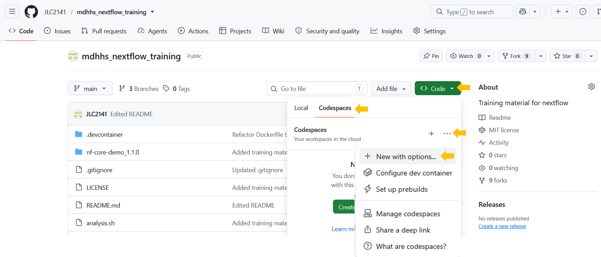

Select the green <> Code icon, the Codespaces tab, the ellipsis, and then select "New with options...". 


Make sure that the branch selection is "main". Select the options for "Machine type". Select the 2-core option but before you do, take note of the virtual machine (VM) that we're about to create. 

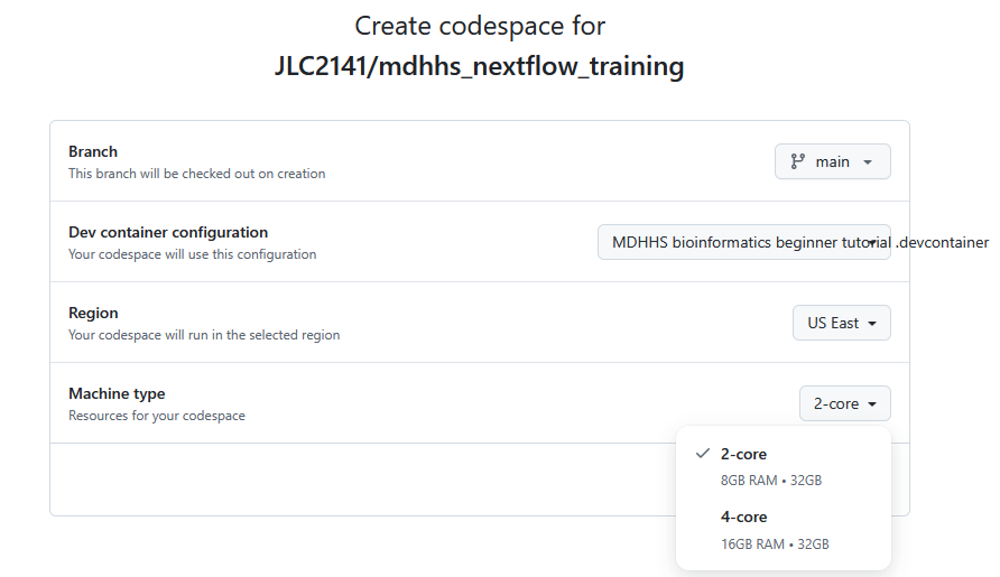

How many CPUs? How much memory will our VM contain?

<details>
<summary>Reveal solution, here</summary>
2 CPU cores
8 GB of RAM

We will need to make use of this information later in this tutorial so keep that this information in mind!
</details>

Finally, create the codespace

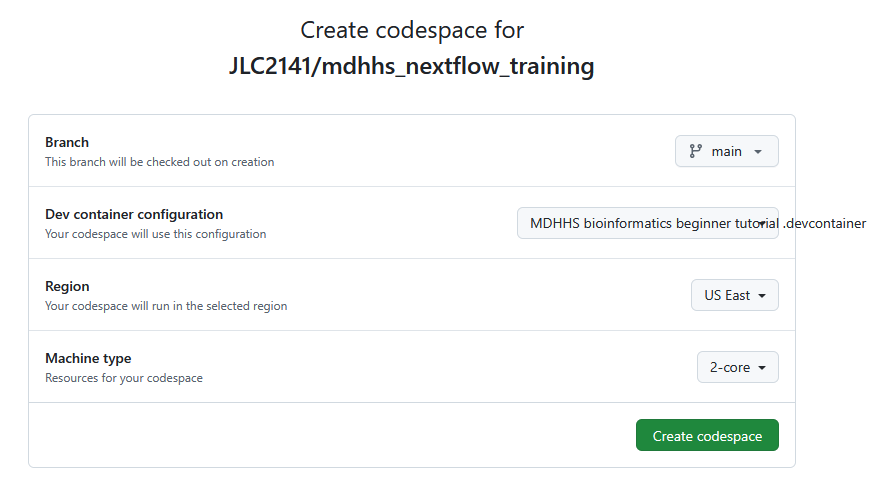

A new codespaces session will launch. It will take a few minutes for the set up to complete. A prompt may appear as such:

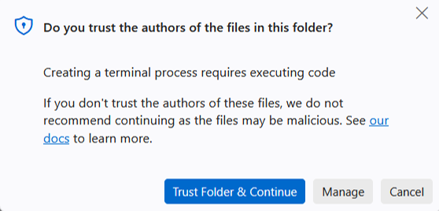

Select "Trust folder & continue". Once codespaces creation is completed, you should see the file explorer panel on the left and the terminal in the lower panel:

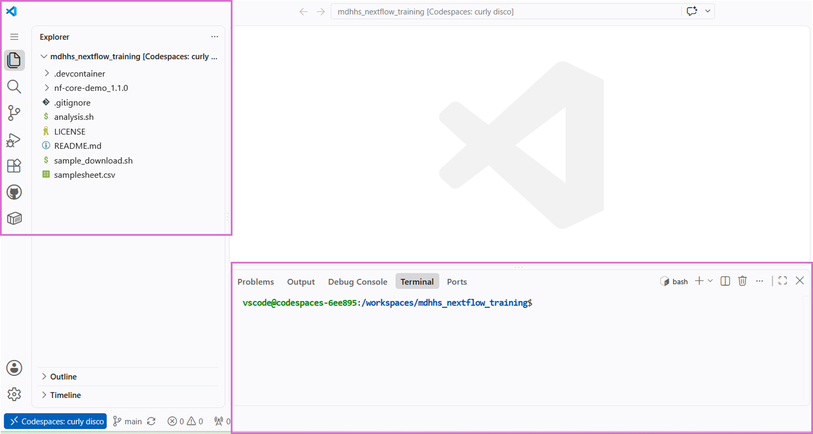

If you do not see the terminal, press F1. You'll be prompted on the search bar. Type the following, "View:toggle terminal", and select that option. 

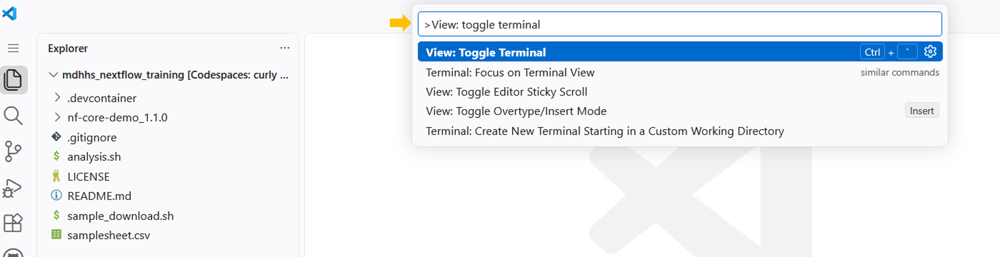

> [!NOTE] <br>
> The greater-than symbol is needed in order to switch from file search mode to command mode.

### Sample download and running the nf-core-demo pipeline

Okay, let's run our first nextflow pipeline! But first, we need to retrieve our FASTQ files. Run the following command on your terminal:

```
bash sample_download.sh
```

> [!NOTE] <br>
> The previous instruction was contained within a code block. I encourage you to type the commands yourself throughout the tutorial but, <br>
> if you fall behind or prefer convenience, then use these code blocks to copy and paste the commands into your codespaces terminal.

For example, navigate back to the GitHub repo, [here](https://github.com/JLC2141/mdhhs_nextflow_training). Right-click on the README.md file and open it in a new tab. 

Locate the previous code block in the README.md file. 

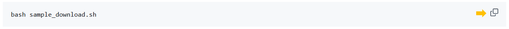

You can click on the icon at the right of the code block to copy, and then paste the code in your terminal. 

Alright, it looks like our FASTQ files have been downloaded. We can confirm this by listing the contents within the reads/ directory:

```
ls reads
```

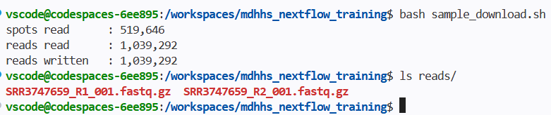


Awesome! Now, all we need to do to start the nextflow demo pipeline is the following:

```
bash analysis.sh
```

Nextflow should launch:

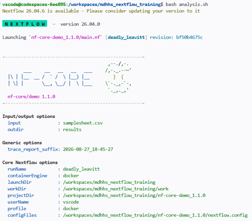

We see a number of things upon the launch:

1) The nextflow version and a message providing the pipeline we launched,
2) Input/output options
    * We see an input samplesheet and a results out directory specified
3) Generic options
    * A time stamp to trace some of the output reports
4) Core Nextflow options
    * runName: randomly assigned. Here, I was given "deadly_leavitt"
        - A unique session ID is provided with each nextflow run. Nextflow provides a human-readable name to simplify referencing it
    * containerEngine: nextflow supports various [engines](https://docs.seqera.io/nextflow/container#container-runtimes) but the most common are docker and apptainer
    * launchDir: path to where we launched the pipeline from
    * workDir: path to where the work directory was created. We'll touch on this concept in a second
    * projectDir: path to the nextflow pipeline of interest
    * userName: Your user name. This was assigned to you during this tutorial creation. We'll address this later. 
    * profile: redundant with containerEngine but this is also an input parameter specfied when we submit the command to run nextflow
    * configFiles: we will learn about [configuration files](https://docs.seqera.io/nextflow/config) in subsequent lessons, but briefly, these allow you to control how your pipeline runs without changing the underlying code. 

### Exploring the nextflow run command

Take a look at the bash script we just ran to start this nextflow pipeline: 

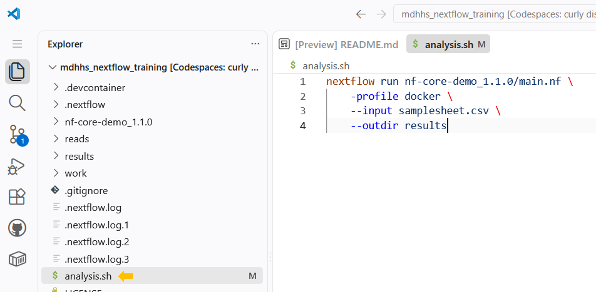

This was the command we used to the launch the nextflow pipeline. At the bare minimum, a nextflow pipeline requires:

1) nextflow run
    * the execution command
2) the pipeline of interest that we want to run (nf-core-demo/_1.1.0)
3) The profile core option, specifying a containerEngine (-profile docker)
4) The input samplesheet.csv file, providing the paths to the FASTQ files (--input samplesheet.csv)
    * select this samplesheet in the file explorer panel and see for yourself
5) An out directory (outdir) where we want to write the results (--outdir results)

> [!NOTE] <br>
> The profile option has 1 dash while the input and outdir parameters have 2 dashes. 
> Nextflow core options contain 1 dash. This affects the behavior of nextflow itself. 
> Pipeline parameters, that affect a single workflow, is specified with 2 dashes. 
> We'll explore another nextflow core option in a second. 

You may be asking yourself why this demo pipeline is named as nf-core, short for nextflow-core. Briefly, [nf-core](https://nf-co.re/docs/get_started/nf-core) is a global community setting strict, best practices for building nextflow pipelines. Not only do they have a curation of community-built [pipelines](https://nf-co.re/pipelines/) freely available for the public to use, they also have command line interface (CLI) that one can use to obtain nf-core pipelines (as we'll see in Part II) and build nextflow pipelines (as we'll make use of for the remaining tutorials part of this training series).

Your pipeline should have completed by now. If so, you should see the following:

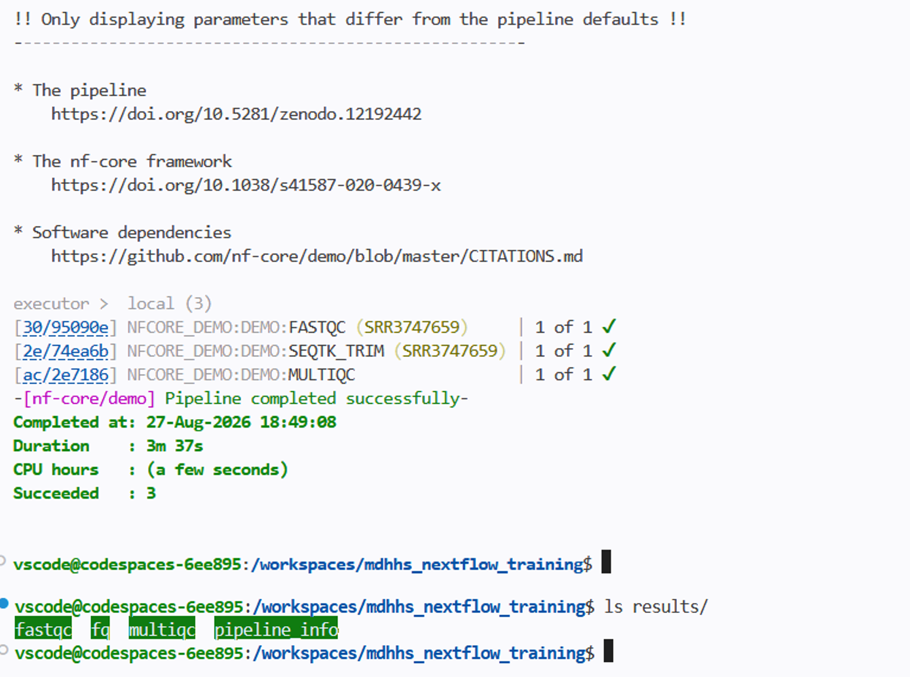


### Exploring the nf-core-demo results

You should see the "Pipeline completed successfully message" along with additional time information. And if you list the contents the results directory, it will be populated with our results:

1) fastqc - results from read QC assessment
2) fq - the SEQTK trimmed FASTQ files
3) multiqc - collation of results from individual tools into a report
4) pipeline_info - a directory containing various reports and files including:
    - [execution report](https://docs.seqera.io/nextflow/reports#execution-report): pipeline run information
    - [execution timeline](https://docs.seqera.io/nextflow/reports#execution-timeline): timelines of tasks in pipeline
    - [trace file](https://docs.seqera.io/nextflow/reports#trace-file): detailed task metrics
    - [workflow diagram](https://docs.seqera.io/nextflow/reports#workflow-diagram): graphical visualization of a pipeline run
    - software_mqc_versions.yml: provides pipleine, nextflow, and tool versions
    - Notice how some of the pipeline info files have the trace report suffix specified at pipeline launch. 

Go ahead and download the multiqc report:

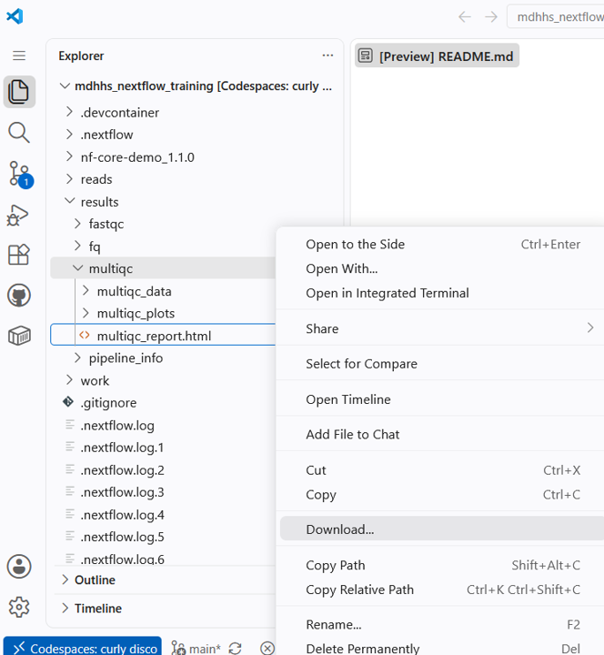

> [!NOTE] <br>
> When you right-click the file, you may need to toggle through the menus with the "Esc" key in order to see the "Download" option. 

Explore this file. We see that we have a report of the FASTQC results from our two FASTQ files. As you will see, more complex pipelines have larger multiQC reports providing summary results from tools used during the analysis. 

Now, on your pipeline completion message, you should also notice the letters and numbers just below the word, "executor". For example, in the image shown above, three separate lines, for each tool run in the pipeline, appears to have unique characters assigned to those tasks. Let's explore what this is. 

### Exploring Nextflow's resume feature

Re-open the analysis.sh file and edit the file to look as such:

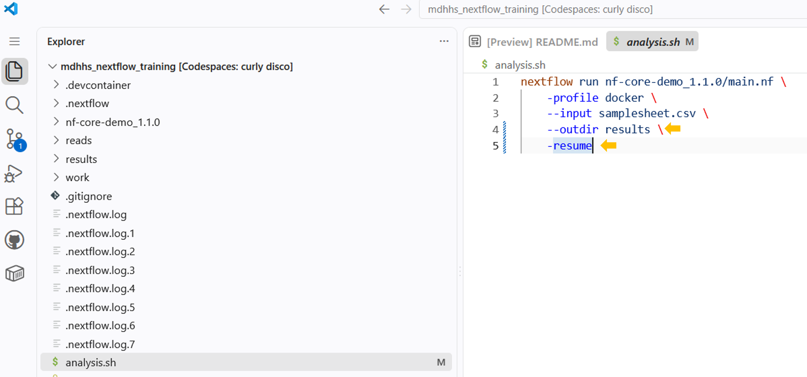

Here we:
1. added a "\" line separator to the --outdir line
2. Added the -resume nextflow core option
    * Remember: 1 dash because it's a core option, not a parameter that we're changing in the pipeline


Save the file: 

```
ctrl+s
```

And restart the pipeline. What do you notice?

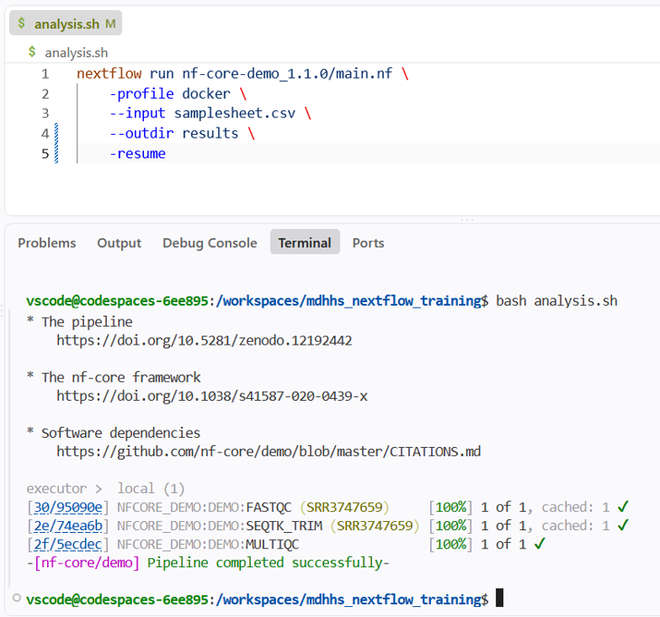

Tasks for FASTQC and SEQTK_TRIM say cached. And what you would notice, if this pipeline was much more computationally intensive, is that the pipeline would complete much faster. Because effectively, what the "cached" means is that that task was saved in a manner that doesn't require a re-analysis upon a pipeline re-run. 

This nextflow [resume feature](https://docs.seqera.io/nextflow/cache-and-resume) is permitted through the combination of the task cache and work directory.
    - The task cache is stored in launchDir/.nextflow/cache/, organized by session ID. This directory stores metadata associated with your pipeline run
    - The work directory, launchDir/work/, stores the actual files associated with the task. The directories are organized by the unique hash associated with the task

For example, let's explore the SEQTK_TRIM task within the work directory. Within the work directory, the unique hash, created from a MD5 checksum, always starts with a two-character prefix followed by the remainder of the hash in a subdirectory. My hash, based on the image above, starts with 2e/74ea6b. Yours will be different. Navigate to your SEQTK_TRIM task within the work directory and display the contents of the directory:

```
cd work/yourHashTo/seqtk_trim
#list contents
ls
#list in long format
ll
```

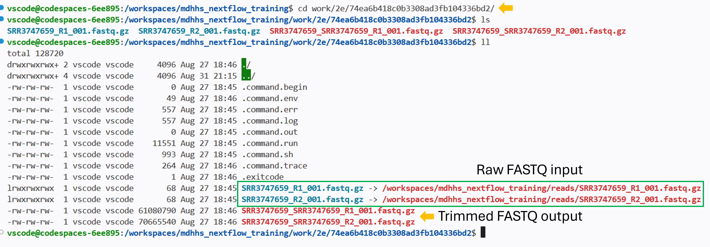

We notice that the full hash actually consists of 32 hexadecimal characters. And using the long list command, we see that the input files came from our reads/ directory, which results in the trimmed FASTQ file outputs. 

Challenge: compare the file sizes of the trimmed FASTQ files to the raw FASTQ files to really convince yourself that SRR3747659_SRR3747659_R1_001.fastq.gz and SRR3747659_SRR3747659_R2_001.fastq.gz are the trimmed reads. 

We can see the actual command that was run by looking at the .command.sh file

```
cat .command.sh
```

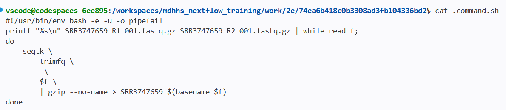

From the seqtk [GitHub repository](https://github.com/lh3/seqtk), we see the very basic usage of the seqtk trimfq command is as follow:

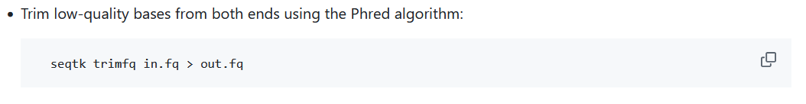

Which is exactly what is occurring in our nextflow pipeline, except with a little more bells and whistles to the command itself. Try copying and pasting the following command into your terminal. 

```
printf "%s\n" SRR3747659_R1_001.fastq.gz SRR3747659_R2_001.fastq.gz | while read f; 
do
    echo $f;
done
```

What is the output?

<details>
<summary>Reveal solution, here</summary>
SRR3747659_R1_001.fastq.gz
SRR3747659_R2_001.fastq.gz

In other words, this command will loop through each of these files individually and execute the command that follows.
</details>

So each raw FASTQ file gets trimmed, piped to gzip, and renamed. 

Okay, so hopefully that provides you a little insight into the nextflow resume feature. The checkpoints provided by resume are particularly useful if your pipeline fails halfway through an analysis and you want to restart your pipeline without having to re-analyze everything from the beginning. 

> [!TIP] <br>
> Work directories can take up a lot of storage. <br>
> In our work, we delete the work directory once a pipeline successfully completes, <br>
> effectively removing the utility of the resume feature. 


### Exploring Nextflow's system logs 

Let's return to our launchDir (/workspaces/mdhhs_nextflow_training) and run the following command:

```
nextflow log
```

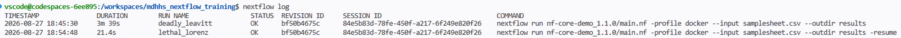

We see various information such as:

* TIMESTAMP
    - The files in /workspaces/mdhhs_nextflow_training/results/pipeline_info/ correspond to the timestamp
* COMMAND
    - The actual command run to invoke the nextflow pipeline
* DURATION
    - Again, notice how much faster the resumed pipeline completed compare to the original run
* RUN NAME 
    - The run name is the human-readable form allowing you to simply refer to a pipeline run. Recall that the "runName" was displayed at the pipeline launch. 
* SESSION ID
    - The task cache is organized by this unique session ID to form the basis of the resume feature

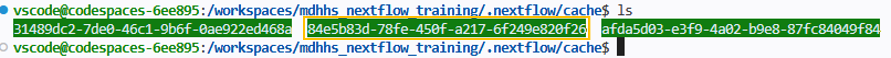


In summary, all nextflow pipelines are able to be invoked from a single-line command providing nextflow core options and pipeline parameter inputs. Under the hood, nextflow has been designed as a powerful workflow management system that enables source tracking of all tasks and files created from an analysis. 

## Part II: Obtaining a pipeline from nf-core command line interface (CLI) and preparing a run

### Remove prior data

Let's replicate what we performed in Part I to start the nf-core-demo nextflow pipeline, but from scratch. Let's start fresh and delete the following files and directories:

```
rm -f samplesheet.csv
rm -rf reads/ nf-core-demo_1.1.0/ results/ work/
```

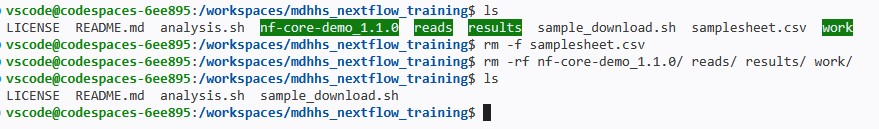

### Use nf-core CLI to download the nf-core-demo pipeline

We will first start by downloading our pipeline of interest. And to do this, we will make use of the [nf-core CLI](https://nf-co.re/docs/nf-core-tools). Check out the link. nf-core commands will always start with nf-core, followed by 1 of 4 categories (modules, pipelines, subworkflows, test-datasets), followed by a command within that category. For example, on your terminal, type: 

```
nf-core pipelines
```

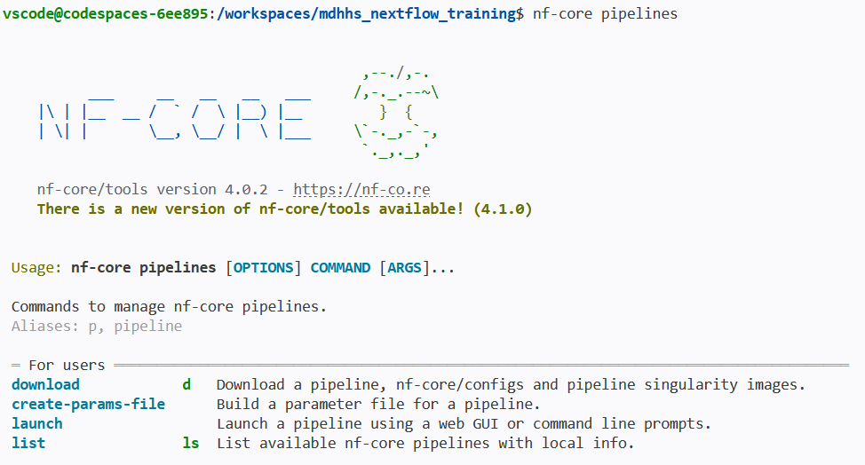

And you can see that we have 4 additional subcommands that we can use. Let's go a step further with a subcommand and type:

```
nf-core pipelines list
```
Scroll through the list until you find the nf-core demo pipeline:

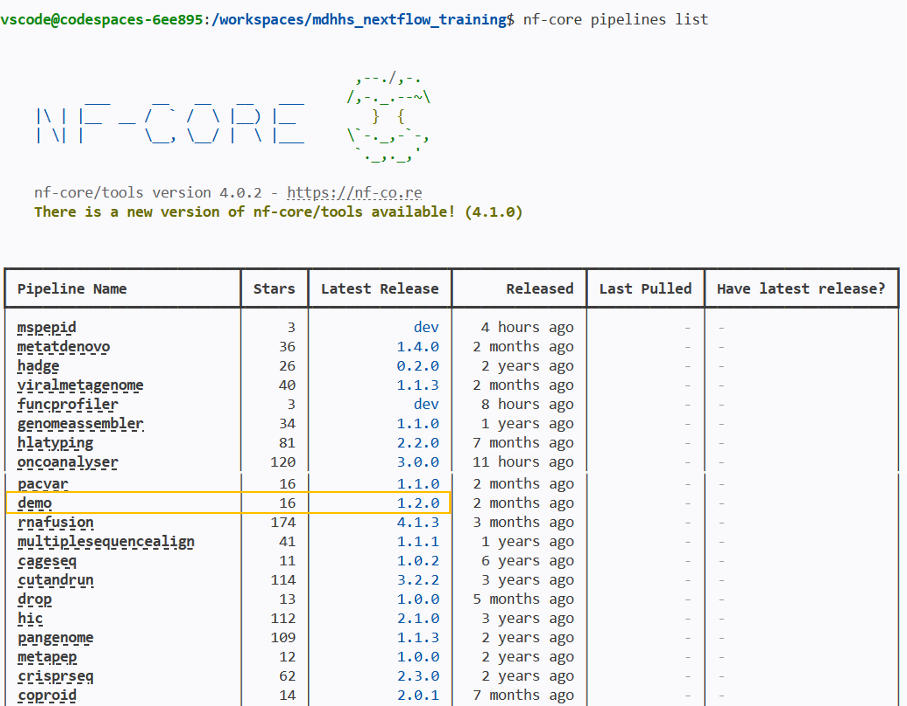

There it is! Okay, let's go another step further and download this pipeline to our computer:

```
nf-core pipelines download
```

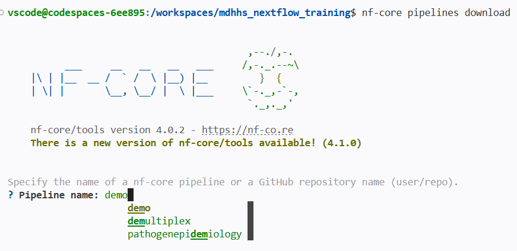

You'll be prompted to enter a pipeline name. Type it all out or use the arrow keys and hit enter to select the demo pipeline.Use the arrow keys to navigate to and enter the pipeline version that you want to download:

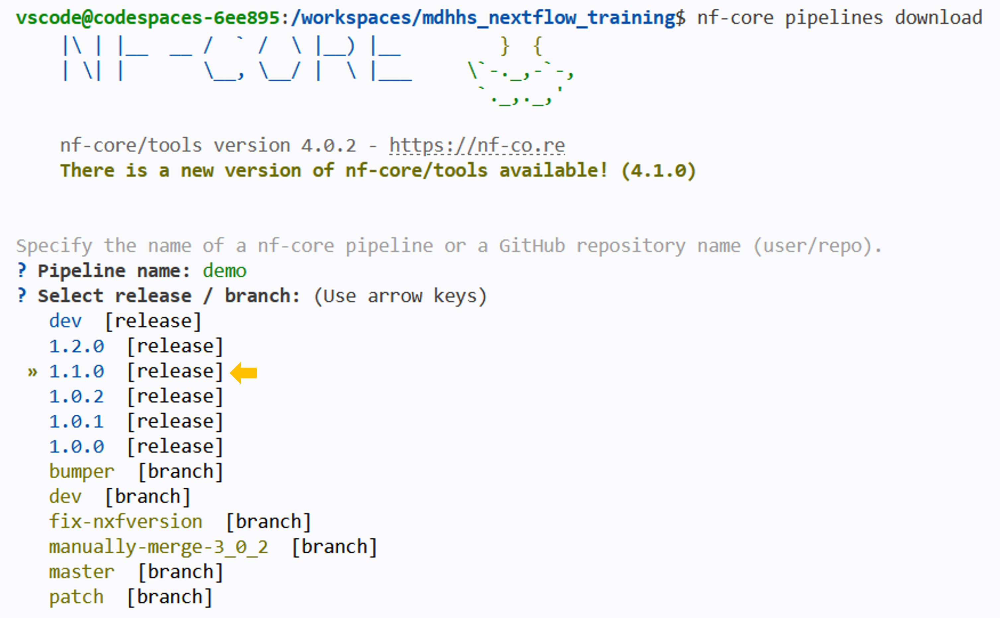

Here, to stay consistent with the pipeline version from Part I, I will select the 1.1.0 release. Next, you'll be prompted if you want to download the containers:

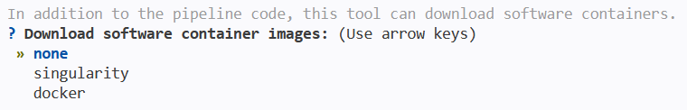

Select "none". Finally, you'll be prompted for compression type:

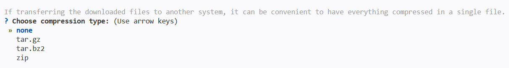

Select "none". If the nf-core pipeline download was successful, you should see the following information along with a new directory containing your nf-core-demo_1.1.0 pipeline:

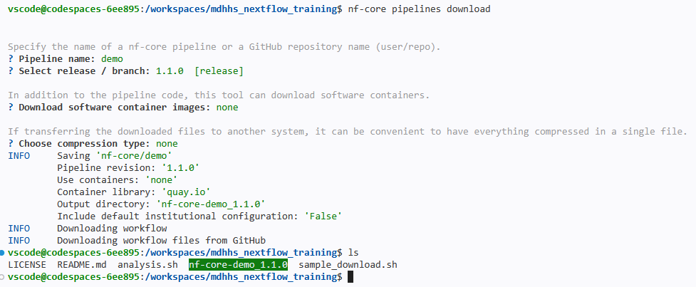

Explore the directory structure: 

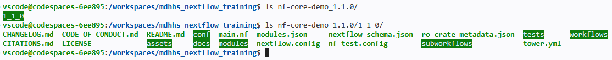

We will get into more details as we build our own pipeline but the presence of the main.nf file is required in order for the nextflow run command to function.

### Download FASTQ files and reorganize

Great! That was step 1. Step 2, we need to obtain our sample of interest. Download our tutorial dataset using the [SRA Toolkit](https://github.com/ncbi/sra-tools/wiki/HowTo:-fasterq-dump):

> [!NOTE] <br>
> Like nf-core, SRA Toolkit also has built in CLI commands.
> And that's what we're using here to retrieve FASTQ files.

```
fasterq-dump SRR3747659
```

> [!NOTE] <br>
> fasterq-dump is a more up-to-date command compared to fastq-dump, but in contrast to fastq-dump, 
> fasterq-dump does not have a built in --gzip option. So we need to perform this ourselves.

```
gzip *.fastq
```

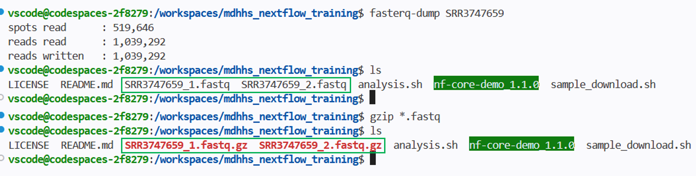


Let's reorganize or FASTQ files into a reads directory

```
mkdir reads
mv *.fastq.gz reads/
```

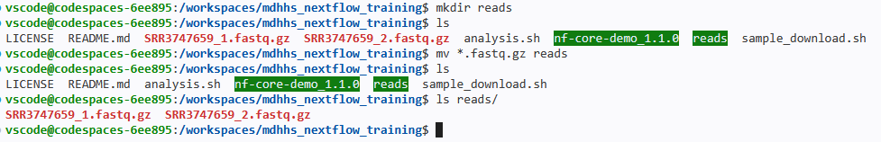

### Samplesheet creation

Step 3, we need to make our samplesheet. As we saw before, this typically takes the form of CSV file:

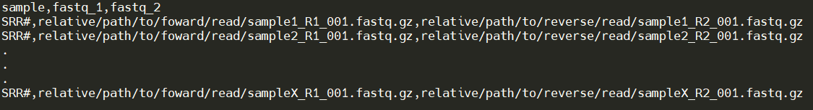

Typically three columns, where the first column represents the SRR accession number (or a unique sample identifier based on your FASTQ file naming scheme) and second and third columns provide the relative paths to the forward and reverse reads for a given sample, respectively. Rows are added for each sample in your analysis. 

Now, say you had 100+ samples to analyze. This CSV file will be tedious to create. So we automate this with a script. In addition to automation, I prefer to be lazy and not reinvent the wheel. There is a script already available from the nf-core community that serves our purpose of automating samplesheet creation. Let's obtain this python script:

```
wget -L https://raw.githubusercontent.com/nf-core/viralrecon/master/bin/fastq_dir_to_samplesheet.py
```

And then look at the help information for the python script:

```
python3 fastq_dir_to_samplesheet.py -h
```
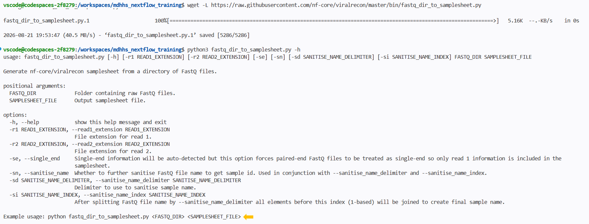

We can see that the path to the FASTQ directory and name of our samplesheet are required inputs, along with other [optional] options. Go ahead and attempt to create the samplesheet as such: 

```
python3 fastq_dir_to_samplesheet.py reads/ samplesheet.csv
```

Ope, we ran into an error! 

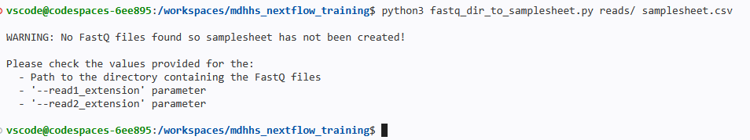

It states that no FASTQ files were found and then states that we need to check our read extension parameters. On the file explorer panel, open the fastq_dir_to_samplesheet.py script. Take a moment to try to figure out what is wrong. 

<details>
<summary>Reveal solution, here</summary>
The python script, by default, expects read 1 and read 2 extensions to be "_R1_001.fastq.gz" and "_R2_001.fastq.gz", respectively. <br>
However, our current read 1 and read 2 extensions are "_1.fastq.gz" and "_2.fastq.gz", which is why the script is not finding our FASTQ files.

<br>

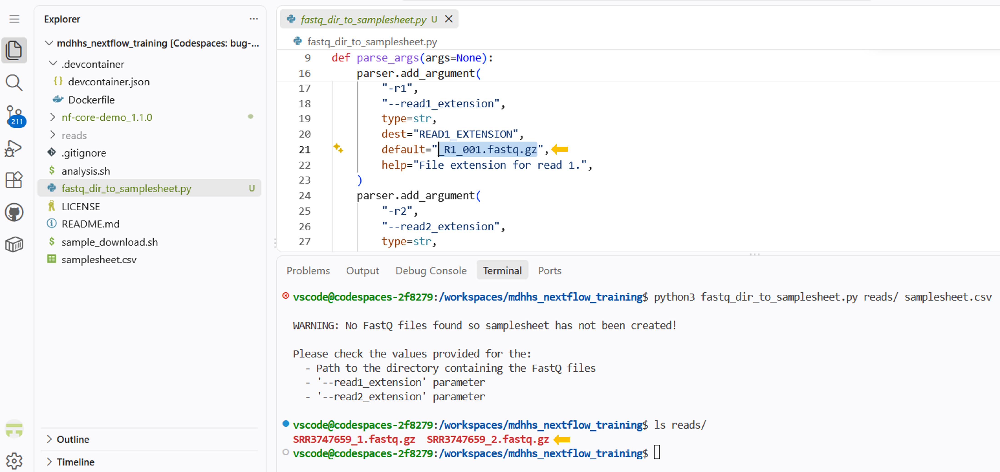

</details>


We have 1 of 2 options here:
1) Add additional parameters, --read1_extension "_1.fastq.gz" --read2_extension "_2.fastq.gz", to our python3 fastq_dir_to_samplesheet.py call
2) Change the extension of our FASTQ files to conform with the expected default

I'm going to take option 2, because it better conforms to standard naming conventions within the sequencing community and, we don't typically obtain FASTQ files from SRR. We routinely obtain FASTQ files from BaseSpace, which normally outputs FASTQ files with "_R1_001.fastq.gz" (forward read) and "_R2_001.fastq.gz" (reverse read) extensions. 

Change into the reads directory and change the file names:

```
cd reads/
mv SRR3747659_1.fastq.gz SRR3747659_R1_001.fastq.gz
mv SRR3747659_2.fastq.gz SRR3747659_R2_001.fastq.gz
```

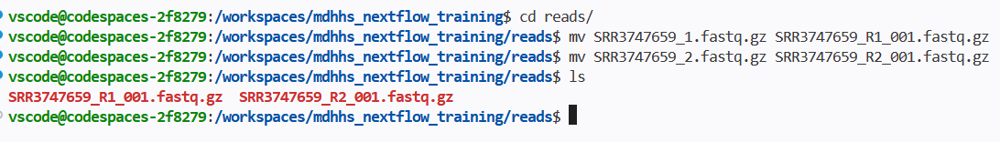

Return to the parent (mdhhs_nextflow_training) directory and try re-running the script

```
cd ..
python3 fastq_dir_to_samplesheet.py reads/ samplesheet.csv
```

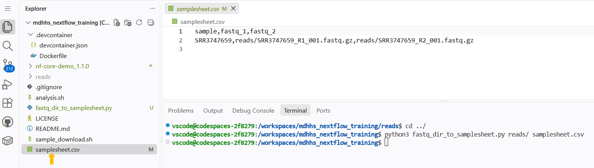

Beautiful! Now it seems to have worked. If we select the samplesheet.csv file from the file explorer pane, we should now see that the relative paths to the forward and reverse reads are in the reads/ directory with the "_R1_001.fastq.gz" and "_R2_001.fastq.gz" extensions, respectively. 

### Alter the nextflow base.config file to conform to CPU and memory availability on our VM

Now, we need to perform this 4th step because of the computational limits of codespace.  

Can you recall what how many CPUs and memory is provided by our VM on codespace?

<details>
<summary>Reveal solution, here</summary>
2 CPU cores
8 GB of RAM
</details>

We need to place computational limits on our nextflow processes in a way that reflects the limits of our computing power. Select on the base.config file contained within nf-core_demo/1_1_0/conf/:

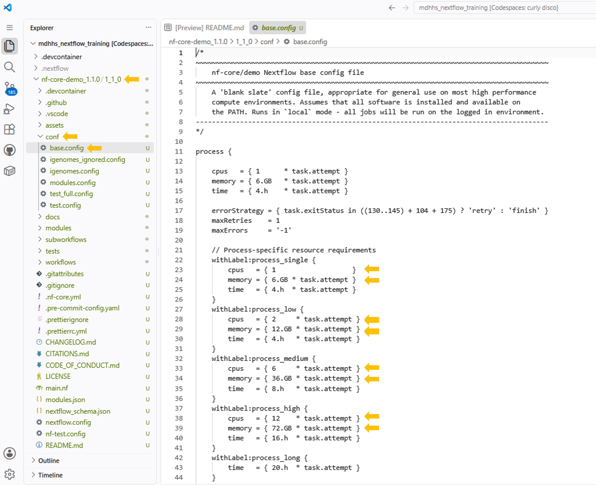

Alter the following lines so that CPU is changed to 1 and memory is changed to 6.GB


And save the file:

```
ctrl+s
```

# Alternative: troubleshoot with copilot ask

If I tried running the pipeline before the previous edits, I would receive one of the following errors:

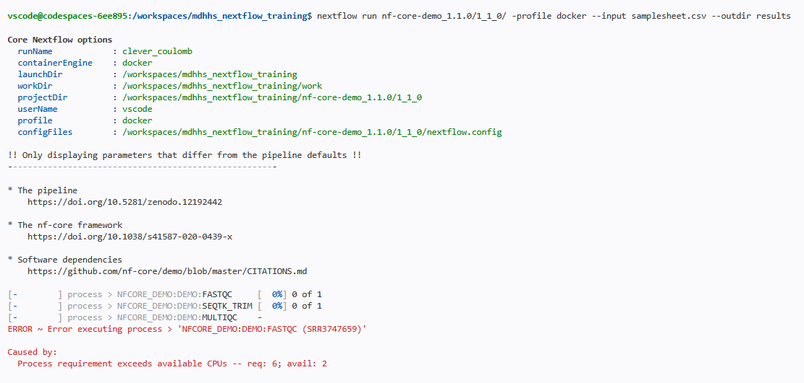

<br>

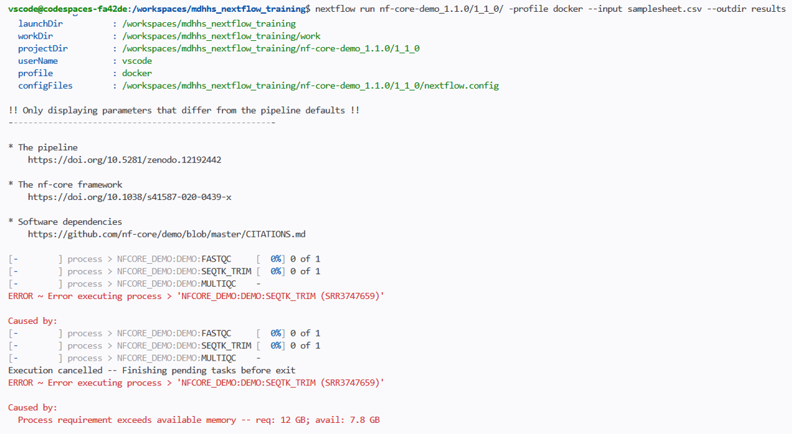

This issue points to computational limits and is somewhat intuitive. Let's see if an LLM can help us troubleshoot this. 

Press F1 and search for the Ask and select "Chat: Open Chat (Ask)"

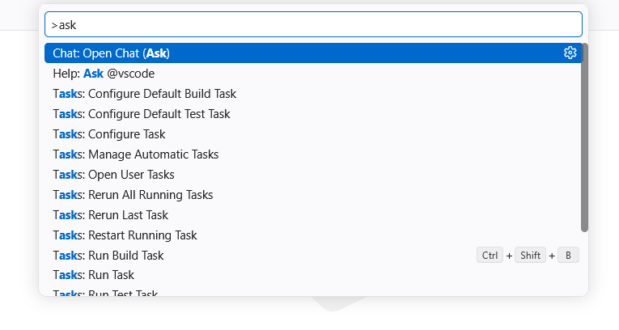

A Copilot chat panel will open on the right side of your screen. Also notice if at the end of the error message that we should check the .nextflow.log file for details. We'll use that to our advantage to provide some context to the LLM chat tool. Select the .nextflow.log file from your file explorer panel and then you should notice that it appears as context within your LLM chat. In addition paste the following message and copy the error your received: 

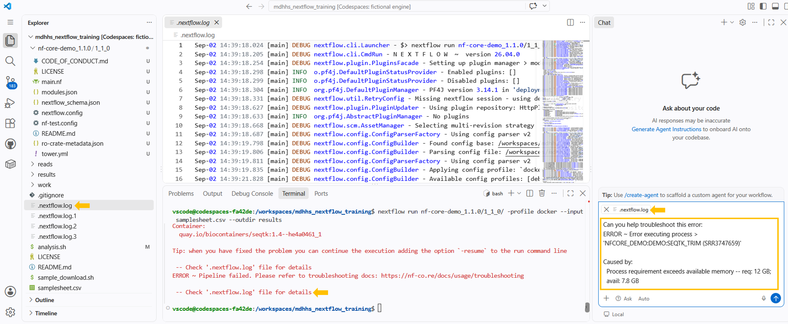

Prompt 1:  Can you help troubleshoot this error: 
ERROR ~ Error executing process > 'NFCORE_DEMO:DEMO:SEQTK_TRIM (SRR3747659)'

Caused by:
  Process requirement exceeds available memory -- req: 12 GB; avail: 7.8 GB

Prompt 2: But what file is specifying memory?

Prompt 3 (with base.config context): This file specifies memory and cpu but where are the process labels being used?


### Run the nf-core-demo pipeline

Now, the 5th and final step of this nf-core demo pipeline is to simply run it:

```
nextflow run nf-core-demo_1.1.0/1_1_0/ -profile docker --input samplesheet.csv --outdir results
```
Success!

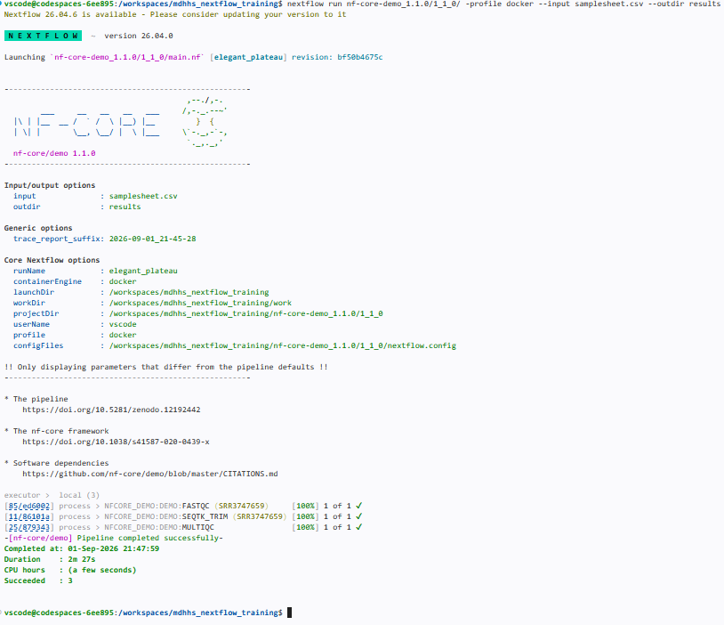

You just performed all the steps I previously prepared for you in Part I.

*Generally*, these are the major steps to get a nextflow pipeline running:

1) Obtain pipeline of interest
2) Obtain FASTQ files
3) Prepare sample sheet
4) Use nextflow run with required parameters to start the pipeline.

But, as you can see here, we needed an additional step due to an error. Other things that may be required prior to a nextflow run is obtaining an external database. Some databases are too large to store on GitHub. 

## Part III: Obtaining a CDC pipeline from GitHub and performing a test run

Only nf-core community-approved pipelines are stored on nf-core. But, you can also obtain nextflow pipelines from GitHub. And they do not have to abide by nf-core standards. For example, the CDC has created plenty of pipelines that are useful to the public health community. 

Let's take [MIRA-NF](https://github.com/CDCgov/MIRA-NF) as an example. This pipeline can be used for influenza, SARS-CoV-2, or RSV analysis and accepts Illumina and ONT data. First, make a new directory call mira_test and change into that directory:

```
mkdir mira_test
cd mira_test
```

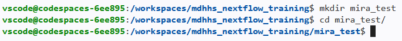

Now, git clone the repository. If you navigate to the MIRA-NF GitHub repository link, above, you can select the following items in order to copy the MIRA-NF URL:

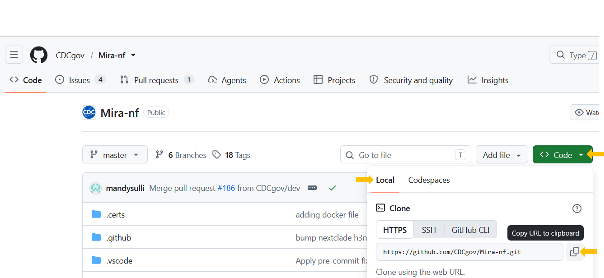

On your codespace terminal, enter the following:

```
git clone -b v2.2.1 https://github.com/CDCgov/Mira-nf.git 
```

Where you can paste the URL you copied from the MIRA-NF GitHub repository after "git clone". I also added the branch flag (-b) to specify the release we want to clone. You can find releases on the right panel of the GitHub repository: 

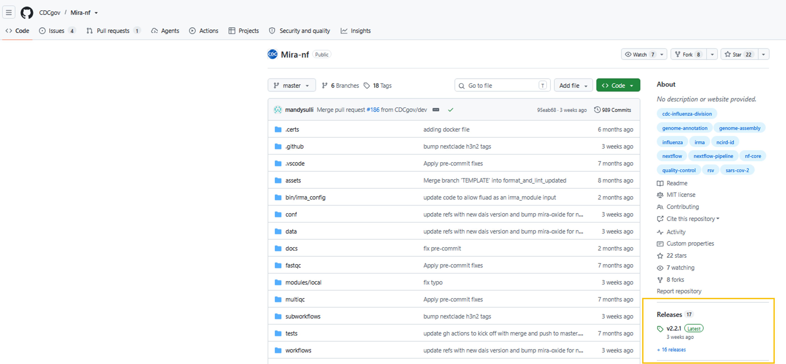

You should see messages indicating that the clone is occurring. And once complete, you should see the repository present on your computer:

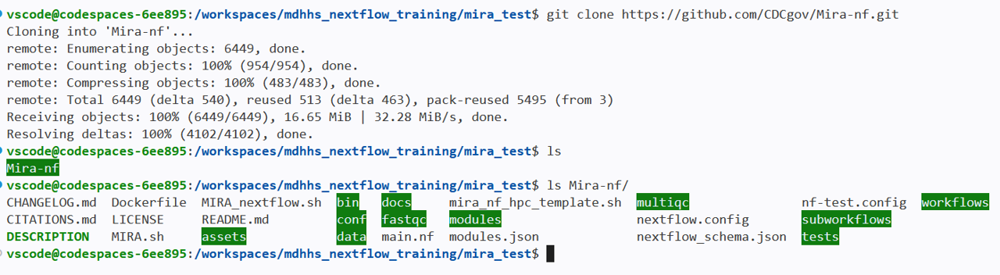

```
ls Mira-nf
```

You might notice that some of these files and directories in this pipeline look similar to the nf-core-demo pipeline. We'll learn more about these files and directories as we begin to build out our own pipeline in the following tutorials. 

For now, enter the following command to run a built-in test of the pipeline:

```
nextflow run Mira-nf \
    -profile docker \
    --e 'Flu-Illumina' \
    --input Mira-nf/tests/test_data/flu_wgs_illumina/samplesheet.csv \
    --outdir results/ \
    --runpath Mira-nf/tests/test_data/flu_wgs_illumina/
```

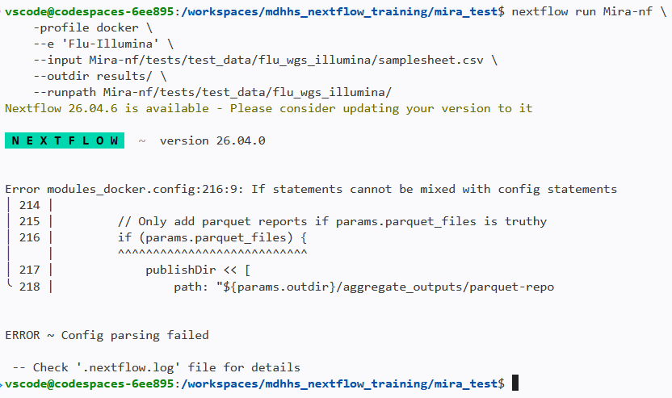

Awesome, another error! In contrast to the error in Part II, this one does not seem as intuitive. And this is the problem with nextflow, sometimes. Because this error is very specific to nextflow, I will take advantage of an LLM that was built specficially with nextflow in mind. 

Sign up for [Seqera AI](https://ai.cloud.seqera.io/login). In the broader context, the [Seqera Platform](https://seqera.io/platform/) is a GUI-based software for launching, managaing, and monitoring nextflow pipelines. But, they also have this neat LLM that is available for all to use.

Once you're logged into a Seqera AI session, you can copy the whole error message from your terminal and paste it into the seqera AI. I then added a message re-specifying the version of Nextflow I'm using. 

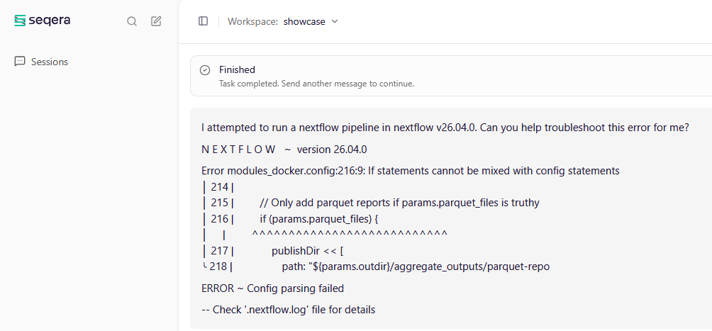

Notice when you copy and pasted the error message that a context-dependent window popped-out. That is a useful feature of Seqera AI. 

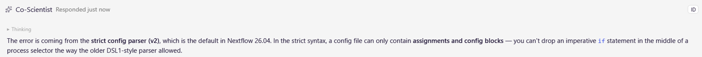

Alright, we received a message that this is due to the strict config parser (v2). This may be a good time to introduce nextflow's [strict syntax](https://docs.seqera.io/nextflow/strict-syntax). The gist of it is that in Nextflow version 26.04 and later, the strict sytax parser (v2) is turned on by default, and has updated rules as to what syntax is allowed when building nextflow pipleines.  

The workaround solution, which is provided as a temporary solution by Seqera AI, is to specify that we want syntax parser v1:

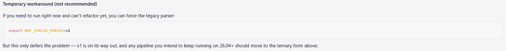

And we can achieve this by exporting this environmental variable (NXF_SYNTAX_PARSER):

```
export NXF_SYNTAX_PARSER=v1
```

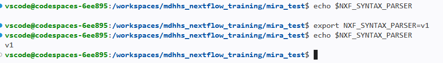

Now, try re-running the pipeline as we did before:

```
nextflow run Mira-nf \
    -profile docker \
    --e 'Flu-Illumina' \
    --input Mira-nf/tests/test_data/flu_wgs_illumina/samplesheet.csv \
    --outdir results/ \
    --runpath Mira-nf/tests/test_data/flu_wgs_illumina/
```

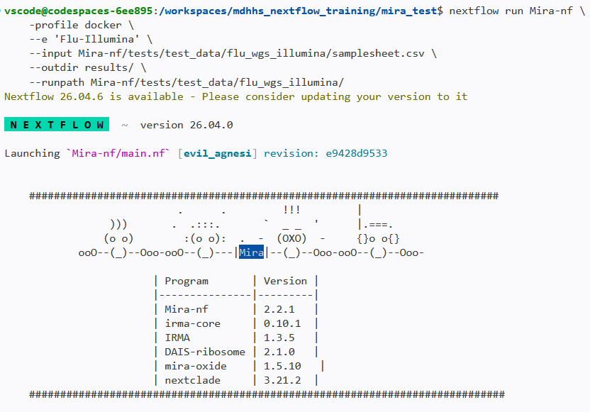


Success!

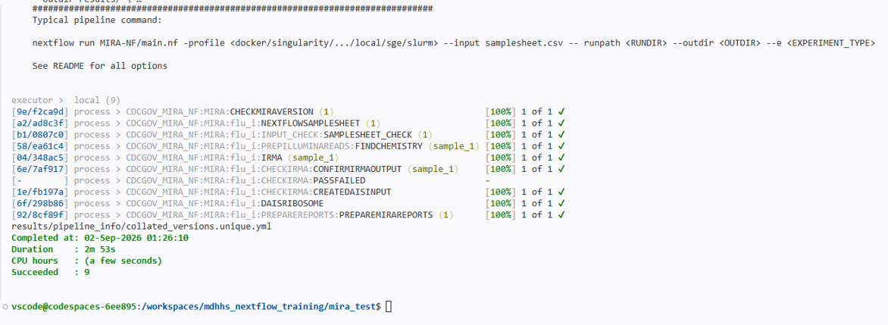

But notice in the temporary workaround solution provided by Seqera AI, it stated that if we "can't refactor yet", use the v1 syntax parser. The idea of refactoring is taking older pipelines built in Nextflow versions <26.04 and updating them to abide by the new syntax rules. Because as you can see from the [strict syntax](https://docs.seqera.io/nextflow/strict-syntax) documentation, eventually the "NXF_SYNTAX_PARSER=v1" option will be phased out in later versions of nextflow. 

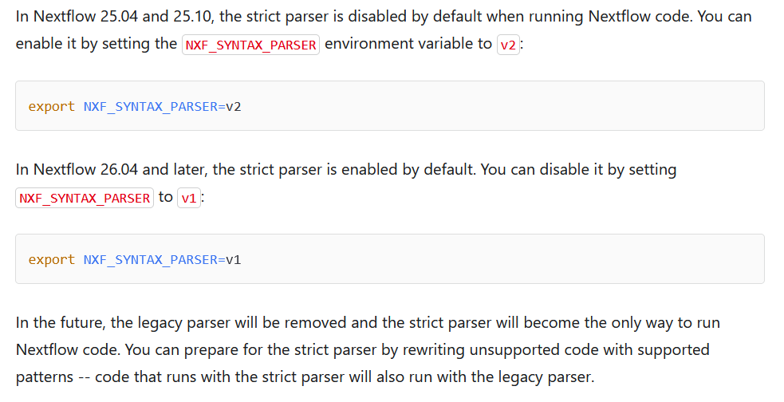

Why I'm emphazing this is that this change is relatively new (Nextflow 26.04 was released in April of 2026). So when want to use a community pipeline, you always have to check which nextflow version you're using and does the pipeline you're using abide to strict syntax parser.

If not, your options are:
1) Downgrade your nextflow version where syntax parser is v1 by default
2) export NXF_SYNTAX_PARSER=v1 while it's still available as an option in Nextflow v26.04.XX

# Alternative challenge

Have folks split up and try to troubleshoot this issue with chatgpt, copilot, or seqera AI.


# Next steps 

If time permits, explore the Dockerfile and edit it to add the NXF_SYNTAX_pPARSER as an ENV variable


Notes: 

MAKE A BRANCH CHECKPOINT WITH THE fastq_dir_to_samplesheet.py SCRIPT

https://docs.seqera.io/nextflow/strict-syntax

ADDRESS USER NAME IN DOCKERFILE

Change original script to original nf-core-demo_1.1.0 organization
    nf-core-dmeo_1.1.0/1.1.0/and then all the directories here
    Update analysis_script.sh and remove main.nf
