# Table of contents
- [Overview](#-overview)
- [Tutorial 2](#-tutorial-2)
- [Part I](#part-i-creating-your-first-nextflow-pipeline-with-nf-core-cli)
- [Part II](#part-ii-adding-a-new-module-and-incorporating-it-into-the-pipeline)
- [Part III](#part-iii-testing-the-pipeline)
- [Recap](#recap)
- [Challenge](#challenge-adding-a-module-alias)

# 📖 Overview

Here is a overview of the pipeline we are going to build:

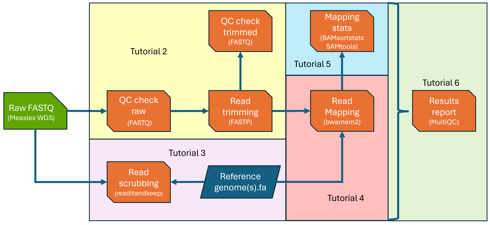

This simple pipeline starts with RAW FASTQ reads obtained from the SRA repository. Specifically, a [measles WGS sequencing sample](https://www.ncbi.nlm.nih.gov/sra?LinkName=biosample_sra&from_uid=61933769) obtained from a broader viral (non-SARS-CoV-2) surveillance effort at Wyoming PHL published under SRA project [PRJNA858824](https://www.ncbi.nlm.nih.gov/bioproject/PRJNA858824)

The pipeline then performs the following steps

1) Read QC on raw FASTQ reads with [FASTQC](https://www.bioinformatics.babraham.ac.uk/projects/fastqc/)
    - What is the quality of our reads off the sequencer?
2) Read trimming with [FASTP](https://github.com/opengene/fastp)
    - Removal of low quality reads and trimmming of low quality bases
3) **Challenge task**: Read QC on trimmed FASTQ reads with [FASTQC](https://www.bioinformatics.babraham.ac.uk/projects/fastqc/)
    - Does the quality of our reads improve post-trimming?
4) Read scrubbing on raw FASTQ reads with [read-it-and-keep](https://github.com/GlobalPathogenAnalysisService/read-it-and-keep)
    - If you anticipated submitting these sequences to a database and wanted to ensure removal of human reads
5) Read mapping with [bwa-mem2](https://github.com/bwa-mem2/bwa-mem2)
    - How well do our trimmed reads map to a reference genome?
6) Read mapping stats with [SAMtools](https://github.com/samtools/samtools)
    - Also converts SAM to BAM if you were to proceed with variant calling
7) Results report generation with [MultiQC](https://github.com/multiqc/multiqc)
    - Aggregates results from our pipeline into a final report

# 📖 Tutorial 2

The objectives of this tutorial are:
1) Use the nf-core command line interface (CLI) to create a new nextflow pipeline with a starter template
2) Learn the standard directory and file structure of a nextflow pipeline
3) Use the nf-core CLI to add a new module
4) Understand required files to edit and nextflow syntax needed to incorporate the module into a pipeline workflow
5) Optional challenge: Use of a `module alias` to use a module twice within a pipeline

<br> 

# Getting started

**Make sure that you are signed-in to your GitHub account.**

Navigate to the GitHub repo for the nextflow tutorial, [here](https://github.com/JLC2141/mdhhs_nextflow_training).

Select the `branch` icon and select the `tutorial_2` branch.

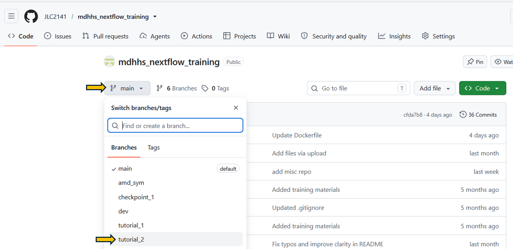

The webpage will reload. Confirm that the `tutorial_2` branch is loaded. Select the green <> Code icon, the Codespaces tab, and then select `Create codespace on tutorial_2`

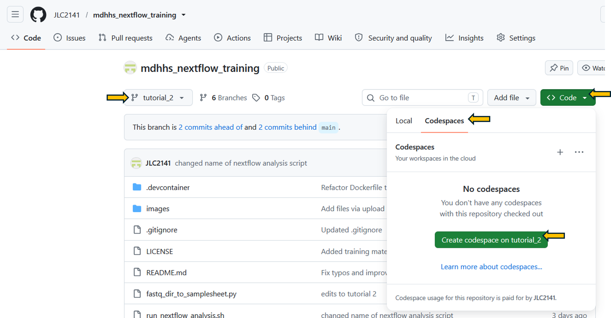

> [!NOTE] <br>
> This will launch a codespace with 2 CPUs, 8 GB RAM, and 32 GB storage capacity <br>
> This is the default minimal virtual machine option for a GitHub codespace <br>

<br>

# Part I: Creating your first nextflow pipeline with nf-core CLI   

> [!NOTE] <br>
> This is a checkpoint from tutorial 1. Nextflow, nf-core, and SRATools are already installed for you <br>
> The samplesheet creation script, fastq_dir_to_samplesheet.py, is also present <br>
> As well as two bash scripts, sample_download.sh and run_nextflow_analysis.sh <br>
> For streamlining FASTQ download and pipeline invocation, respectively.  


### Create your first pipeline

We will be building our pipeline using the [nf-core CLI](https://nf-co.re/docs/nf-core-tools). Check out the link. nf-core commands will always start with nf-core, followed by 1 of 4 categories (modules, pipelines, subworkflows, test-datasets), followed by a command within that category. For example, on your terminal, type: 

```
nf-core pipelines
```

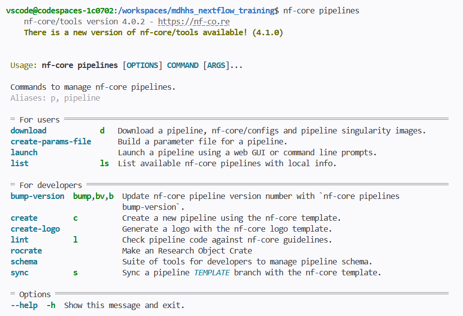


You can see the list of available commands within the nf-core pipelines. Recall in tutorial 1, we used `nf-core pipelines download` to retrieve a previously built nf-core pipeline. Here, we will use the `create` command to create our first pipeline using the nf-core template:


```
nf-core pipelines create -n "myfirstpipeline" -d "Tutorial for building nextflow pipelines with nf-core CLI" -a "John"
```

Where: <br>
`nf-core pipelines create`: invokes an nf-core CLI command <br>
`-n`: name of your pipeline <br>
`-d`: description of pipeline <br>
`-a`: pipeline author <br>


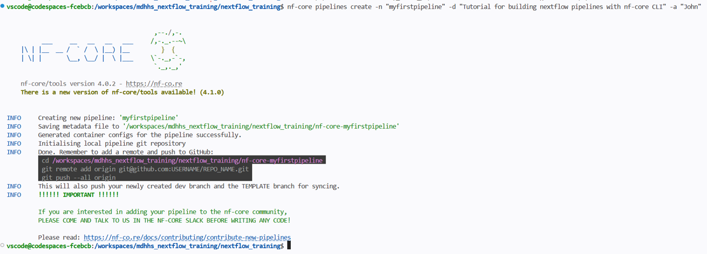

Looks like it succeeded! Notice in the image below that my first attempt to create a pipeline failed:

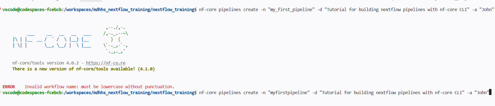

Notice what was different?

<br>

<details>
<summary>Reveal solution, here</summary>
I attempted underscores in the pipeline name. 
</details>

<br>

The nf-core CLI did not allow that and my command errored out with the following error: 

```
"ERROR Invalid workflow name: must be lowercase" without punctuation.
```

This was easily fixed by removing the underscores. But, this was a nice introduction into the nf-core principles. You might be asking yourself, what exactly is [nf-core](https://nf-co.re/docs/get_started/nf-core)? In short, nf-core is a global community setting strict (like pipeline name restrictions), best practices for building nextflow pipelines. You can create a nextflow pipeline, and then you can go beyond that to create an nf-core compliant nextflow pipeline. Specifications for creating an nf-core compliant nextflow pipeline can be view [here](https://nf-co.re/docs/specifications/overview).

<br>

> [!NOTE] <br>
> When you use the nf-core CLI, it will tell you when we are not abiding to nf-core principles (as seen in the error, above) <br> 
> But, we will not be creating an nf-core compliant nextflow pipeline for this nextflow training. <br>
> However, the nf-core CLI is an invaluable resource, and will be used in this tutorial when building our nextflow pipeline. <br>
> I also recommend it for all your future endeavors when building nextflow pipelines. <br>

<br>

### Exploring pipeline contents

Navigate to your file explorer pane on the VS Code editor and take a look at the contents of your new pipeline:

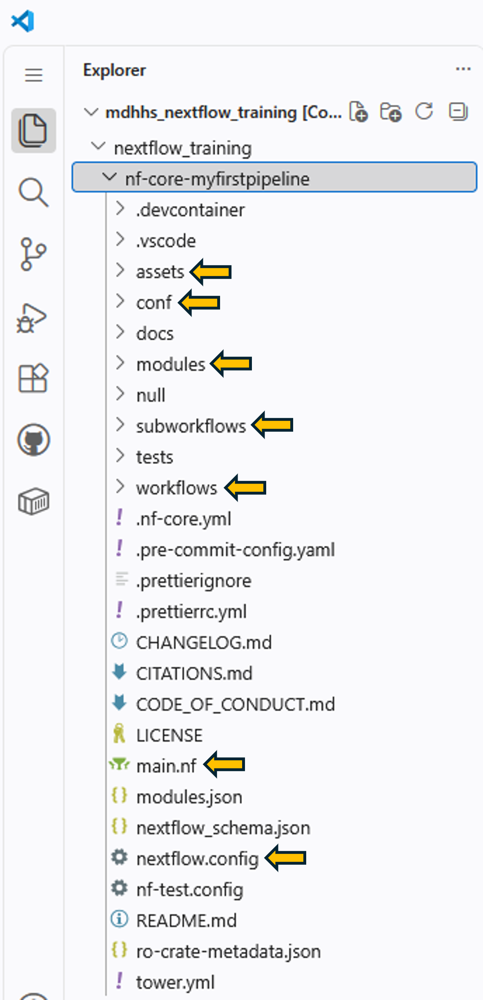

There is a lot to unpack here but we will only focus on the main aspects of building a nextflow pipeline in this beginner tutorial. 

We will encounter the following files:

1) **main.nf**: The default and required script for `nextflow run` command functioning if no other script is specified. Here:
    - pipeline initialization checks occur 
    - our `samplesheet.csv` is converted into channel (`ch_samplesheet`)
    - and you can also specify which pipeline you want to run (pipelines stored in the `workflows/` directory)
    - for example, you could create separate pipeline for Illumina (`workflows/mypipeline_illumina.nf`) and ONT (`workflows/mypipeline_ont.nf`) reads 
2) **nextflow.config**: the main configuration file containing default pipeline parameters and nextflow configuration options

And the following directories: 

3) **assets/**: storage of reference files and databases
4) **conf/**: additional configuration files for module-specific parameters, defining compute, and testing. The most important being:
    - `base.config`: defining computing resources
    - `modules.config`: defining bioinformatic tool parameters and output format
5) **workflows/**: location of individual files for pipelines. This is where we'll build our workflow through the combination of `modules`, `channels`, and `operators`. Workflows contained here are executed from the main.nf file (`nf-core-myfirstpipeline/main.nf`)
    - Can contain multiple pipelines (`name_of_pipeline.nf`) within the `workflows` directory
6) **modules/**: where individual bioinformatics tools and/or processes of a pipeline are stored. Organized into `modules/nf-core/` and `modules/local/` directories depending if the module is sourced from nf-core (as seen here in Tutorial 2 and 4) or manually created (as we'll encounter in Tutorial 3), respectively. 
    - **NOTE**: you'll notice that `modules` and `process` seem to get used interchangeably
    - Generally speaking, a `module` is a complete, sharable unit of modular code
    - a `module` encapsulates a single `process` definition, which provides all the components to execute a block of code (inputs, outputs, and script block)
    - a `module`refers to the modular, shareable component while the `process` is the actual code contained within the `module`
7) **subworkflows/**: mini workflows chained together
    - Useful for a set of processes commonly used in a bioinformatics workflow (as we'll encounter in Tutorial 5).
8) **bin/**: custom scripts that can be incorporated into modules. 
    - **NOTE**: this directory is currently not present from our initial nf-core pipeline creation but we will make use of it down the road.

For more details on all files and directories, see [here](https://nf-co.re/docs/developing/pipelines/template-files).

A lot of files and directories have already been downloaded and prepared for you with that one command. That is the utility of the nf-core CLI. Nextflow expects and requires this pipeline organization of files and directories described, above. Now, we could have gone through the tedious process of creating all of these directories and files from scratch, but it's not worth it given the convenience of the nf-core CLI. And we will continue to make use of nf-core CLI to streamline our pipeline build. 

> [!NOTE] <br>
> It is important that you familiarize yourself with this general directory structure of nextflow. <br>
> These are common files and directories you'll see throughout all types of bioinformatics pipelines built with nextflow. <br>
> The details of these files and directories will become clearer throughout the tutorial. 


# Part II: Adding a new module and incorporating it into the pipeline

### Add a new module via nf-core CLI

Okay, let's continue building our pipeline! Navigate to our new pipeline directory:


```
cd nf-core-myfirstpipeline
```

**This is because subsequent nf-core CLI commands are meant to occur inside of the nextflow pipeline directory where it can locate files and directories for proper functioning.**

From here, let's try to install our first module (or tool). A common tool in every bioinformatics pipeline is FASTQC, where we first want to look at quality of our raw reads. 

```
nf-core modules install fastqc
```

What do you notice?

<br>

<details>
<summary>Reveal solution, here</summary>
<br>

It appears that this tool was already installed by default when we created our pipeline. Convenient! 

<br>

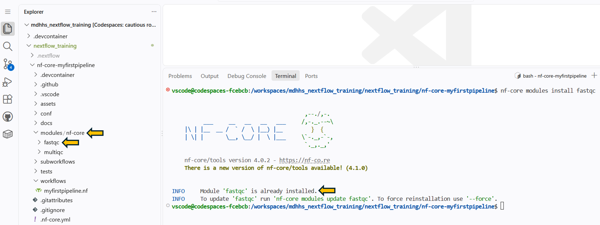

<br>

We can confirm that on our file explorer panel by revealing the contents of our `modules/` directory. Here, we see that FASTQ and MultiQC (we'll visit this in tutorial 6) are installed in a subdirectory called `nf-core/`. 

</details>

<br> 

> [!NOTE] <br>
> When we install modules (or tools) that have been [precompilied](https://nf-co.re/modules/) by the nf-core community, they will be installed into the `modules/nf-core/` directory. <br>
> Spoiler alert: this is in contrast to what we'll see in tutorial 3 where we will create a new module from an nf-core template, which gets installed into the `modules/local/` directory. 

Okay, let's keep building our pipeline! Raw reads are usually never good enough to use for downstream purposes. So, the next logical step in our pipeline is to trim the reads. For this, we will install the FASTP module.

```
nf-core modules install fastp
```

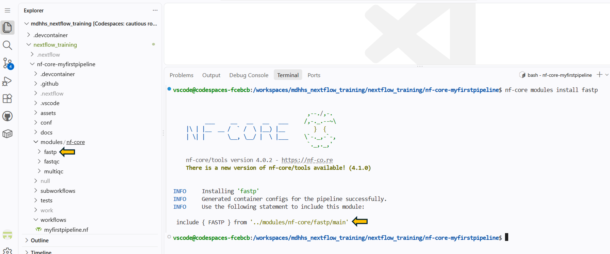


We see that fastp was automatically added to the `modules/nf-core/` directory. In addition, take note of the following line:

```
include { FASTP } from '../modules/nf-core/fastp/main'
```

<details>
<summary>Spoiler</summary>

This line will be needed to import the FASTP module into our `workflows/myfirstpipeline.nf` workflow

</details>

<br>

### Explore the structure of a module main.nf file

Select on the fastp directory and select the main.nf file:

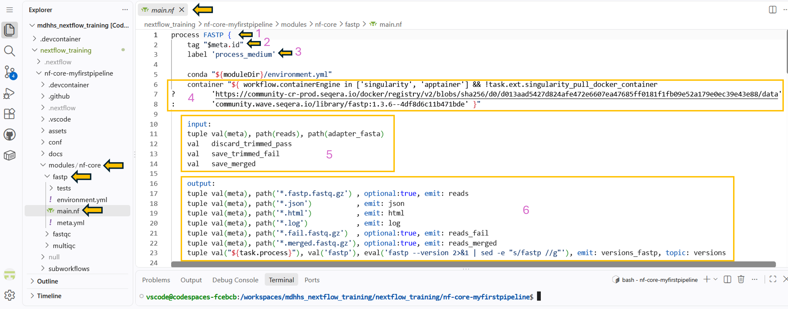

The fastp main.nf file will open on the top panel. Let's stop here for a second to discuss something:

<br>

> [!NOTE] <br>
> You will notice that the individual modules (and as you'll see, the subworkflows) also have a `main.nf` file <br>
> But the `main.nf` file within your project directory (`nf-core-myfirstpipeline/main.nf`) is the "main" `main.nf` <br>
> This is the result of a Domain Specific Language (DSL) [migration](https://docs.seqera.io/nextflow/migrations/dsl1) from DSL1 to DSL2 <br>
> In DSL1, your whole workflow would be one longgggggg `main.nf` file. But now, in DSL2, the organization is briefly summarized as:

<br>

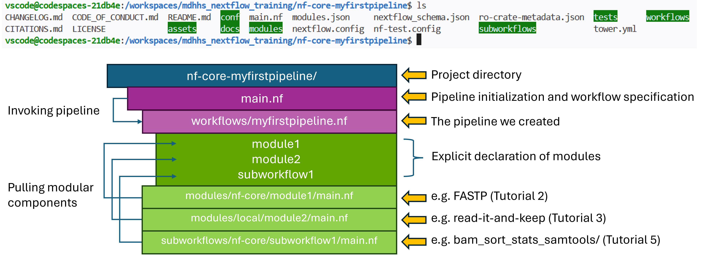

<br>

> The takehome is that modularization was incorporated  in DSL2 where you could: <br>
> 1) create multiple workflows, stored in `workflows/` (e.g. `workflows/myfirstpipeline.nf`) <br>
> 2) define modules and subworkflows outside of the workflow (e.g `modules/nf-core/fastp/main.nf`) and pull them into your workflow <br>
> 3) Pulling is performed by importing the modules or subworkflows into your pipeline script and the explicitly declaring them within your workflow


Okay, now back to the FASTP main.nf file:

<br>


<br>

There's a lot to take in here. But let's break down each component for simplicity (each number is referenced in the image)

1) The first line of this module defines the [process](https://docs.seqera.io/nextflow/process), and the process itself is uppercase as a result of [nf-core naming conventions](https://nf-co.re/docs/specifications/components/modules/naming-conventions#name-format-of-module-processes). We will stick to this naming convention because it will help distinguish pipeline components (modules vs channels vs operators) in our workflow.  
    - Think of the process as the actual code present in this file while the module is a reusable component for a nextflow workflow 
2)  tag represents a custom identifier for each task execution of your process. The $meta.id is uniquely tied to the [meta map](https://nf-co.re/docs/developing/components/meta-map) created for our sample(s) contained in the samplesheet.csv. This takes the form of:

```
[meta.id, [fastq_1, fastq_2]]
```


- **The meta.id tag is our unique sample identifier tied to our FASTQ reads that can be used in our process to link sample IDs to process inputs/outputs.**

- For example, say you had 3 samples and they are all processed through FASTP. The tag makes sure that each unique sample ID is associated with its read pair, both when used as input into the FASTP module and when output as trimmed reads. 

3) Refers to the computational specifications (CPUs, memory, and max time) stored in `conf/base.config`
4) Declaration of our container for our process. Nextflow supports various [containers](https://docs.seqera.io/nextflow/container) but you will typically only see docker or apptainer (formerly known as singularity). Containers are pre-packaged software containing all of the dependencies and installations need to run your tool (in this case FASTP). This enhances modularization because each process can contain a unique container that is only used when called upon in a workflow. We will cover this in more detail in tutorial 3. 

<br>

> [!NOTE]
> Notice how this FASTP container takes the form of `condition ? true : false` <br>
> This is a conditional if-else statement you'll notice throughout other parts of the process code. `?` and `:` provide a concise way to write `if-else` statements in [Groovy](https://zetcode.com/groovy/conditionals/) <br>
> This statement is essentially saying: `if` the container profile is apptainer/singularity, obtain and use the singularity container, `else`, obtain and use the docker container. <br>  

<br>

These first 4 components are examples of process [directives](https://docs.seqera.io/nextflow/process#directives), or put simply, optional settings for a process, though I would argue that the `meta.id` tag is becoming pretty standard (not optional) in nextflow pipelines.

5) Inputs to the process. These should match the input descriptions on the nf-core [documentation](https://nf-co.re/modules/fastp/#input). 
- Inputs take a qualifier, followed by a name. Various qualifiers can be viewed, [here](https://docs.seqera.io/nextflow/process#inputs). For FASTP, we see a val, path, and tuple qualifiers. <br>
- The [val](https://docs.seqera.io/nextflow/process#input-variables-val), or value, qualifier accept any data type but it's best to refer to the documentation of the tool to see what type of value it expects. <br>
- The [path](https://docs.seqera.io/nextflow/process#input-files-path) qualifier requires the path to input files. <br>
- The [tuple](https://docs.seqera.io/nextflow/process#input-tuples-tuple) groups various qualifiers together, and in this case, uniquely ties the val of our `meta.id` tag (aka sample name) to the path of our `reads` <br>
        - and to the path of an adapter file (but we'll remove this `path(adapter_fasta)` qualifier as we begin to edit this module)
6) Outputs of the process. Again, these should match the nf-core documentation of FASTP [outputs](https://nf-co.re/modules/fastp/#output). These also take qualifiers. Just focus on the first line.
- Here, we are creating a tuple output to link our `meta.id` (aka sample ID) to the path of our `trimmed_reads`. 
- The `emit:` option, as you'll soon see, will also us to channel the `trimmed_reads` to the subsequent module in our `workflows/myfirstpipeline.nf` pipeline.

<br>

Let's keep scrolling through our FASTP module `main.nf` file and view a second snapshot of its contents:

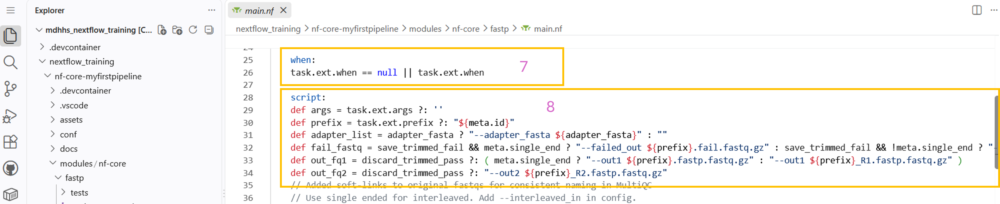


7) [when](https://docs.seqera.io/nextflow/process#when) is a conditional logic statement to run the process (or not). <br>
- To be honest, I don't use this at all. And by default, the statement currently sets `null==true`, meaning this process is set to run by default unless you explicitly state a condition in which this process should (or should not) run
8) The [script](https://docs.seqera.io/nextflow/process#script) section. The script itself is interpreted as Bash script by default. We start with definition (def) arguments which are unique to script itself. For example, in this example:

```
def prefix = task.ext.prefix ?: "${meta.id}"
```

- It's saying, if a `ext.prefix` is defined somewhere (as we'll learn, that "somewhere" is typically within the `conf/modules.config` file), then the `prefix` argument is assigned that string <br>
- Otherwise, `prefix` is assigned to the `meta.id` tag (aka the sample ID). In other words, `meta.id` is assigned to `prefix` if `ext.prefix` is null. See [Elvis operator](https://zetcode.com/groovy/conditionals/)

<br>

<details>
<summary>The other arguments in this image include... reveal here</summary>

```
def args = task.ext.args ?: ''
```
if `ext.args` is present (which, as you'll see, is also declared in `conf/modules.config`) use it, else it's blank

<br>

```
def adapter_list = adapter_fasta ? "--adapter_fasta ${adapter_fasta}" : ""
```
if the `--adapter_fasta` input parameter is present, define is as `adapter_fasta`, else it's blank

<br>

```
def fail_fastq = save_trimmed_fail && meta.single_end ? "--failed_out ${prefix}.fail.fastq.gz" : save_trimmed_fail && !meta.single_end ? "--failed_out ${prefix}.paired.fail.fastq.gz --unpaired1 ${prefix}_R1.fail.fastq.gz --unpaired2 ${prefix}_R2.fail.fastq.gz" : ''
```
if the `save_trimmed_fail` parameter is `true` AND the `meta.id` tag is from single end reads, then create the parameter `--failed_out ${prefix}.fail.fastq.gz` parameter/output, <br>
else if the `save_trimmed_fail` parameter is `true` AND the `meta.id` tag is *not* (`!` character in `!meta.single_end`) from single end reads, <br>
then output (`--failed_out`) failed paired reads as `${prefix}.paired.fail.fastq.gz`, output (`--unpaired1`) failed unpaired forward reads as `${prefix}_R1.fail.fastq.gz`, and output (`--unpaired2`) failed unpaired reverse reads as `${prefix}_R2.fail.fastq.gz"`,  <br>
otherwise, the `fail_fastq` argument is blank

<br>

```
def out_fq1 = discard_trimmed_pass ?: ( meta.single_end ? "--out1 ${prefix}.fastp.fastq.gz" : "--out1 ${prefix}_R1.fastp.fastq.gz" )
```
if `discard_trimmed_pass` parameter is `true`, then do nothing because passed trimmed reads are discarded, <br> 
else if `false` AND if the `meta.id` tag is from single end reads, the create the `--out1 ${prefix}.fastp.fastq.gz` parameter/output, <br>
else create the `--out1 ${prefix}_R1.fastp.fastq.gz` parameter/output

<br>

```
def out_fq2 = discard_trimmed_pass ?: "--out2 ${prefix}_R2.fastp.fastq.gz"
```
if `discard_trimmed_pass` parameter is `true`, then do nothing because passed trimmed reads are discarded, <br>
else if `false` and the `meta.id` tag is from single end reads, the create the `--out2 ${prefix}.fastp.fastq.gz` parameter/output, <br> 
else create the `--out2 ${prefix}_R1.fastp.fastq.gz` parameter/output

</details>

<br>

Following `def` arguments, in it's simplest form, are three, double quote characters. It's more like a """quote character sandwich""" encapsulating the bash script. For example: 

<br>

```
process FASTP {
    directives go here
    
    input:
    #place inputs here
    
    output: 
    #place outputs here

    when: 
    #optional conditional statement for running process

    script:
    def arguments 
    """
    Bash script is placed here
    """
}
```

<br>

We essentially have that within our FASTP bash script, except it is a little more complicated. An `if-elseif-else` statement defines three possible script blocks, each encapsulated in the:

```
"""
quote sandwich
"""
```

as seen in the three images, below: 

Exhibit A
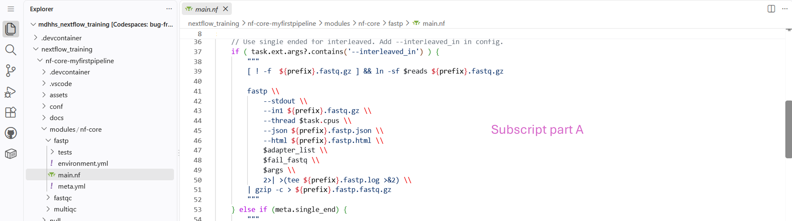

<br>
Exhibit B

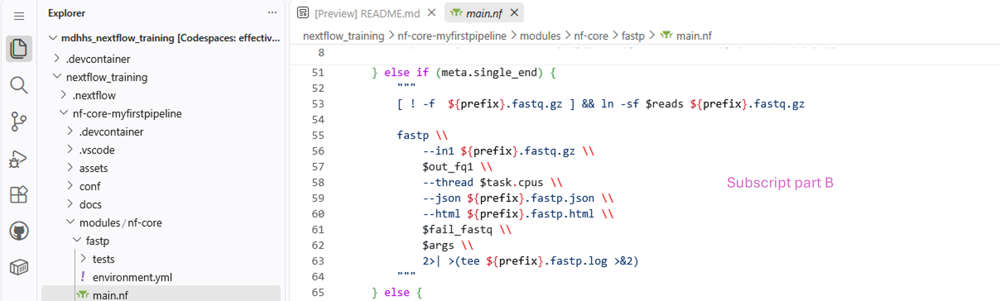

<br>
Exhibit C

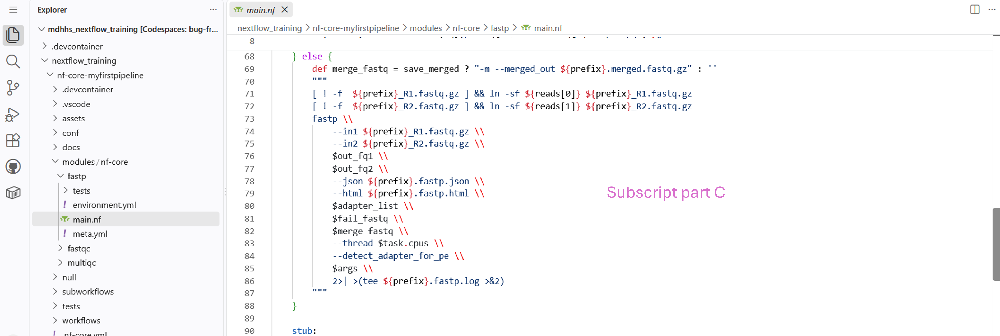

<br>
Basically, the FASTP bash script if split into an if-elseif-else statement that says:

```
if "my reads are interleaved" {
    """
    run this bash script
    """
} else if "my reads are single-end reads" {
    """
    run this bash script
    """
} else {
    """
    run this bash script
    """
}
```

Now, we have prior knowledge that are reads are paired, meaning we have a forward and reverse FASTQ file for our sample. Examine the prior three images of the FASTP script.
Which exhibit (or rather script block) do you think applies to our FASTQ read files (A, B, or C)?

<br>

<details>
<summary>Reveal solution, here</summary>

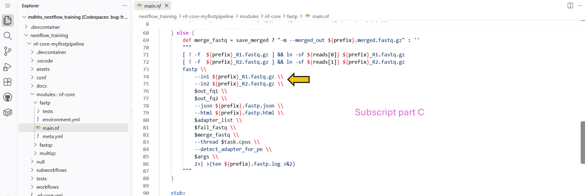

The big tell is that this last script accepts paired reads, as shown by the `--in1` and `--in2` fastp input parameters.

</details>

<br>

> [!NOTE] <br>
> `inputs`/`directives` transformed to definition arguments, defined prior to the script block, are accessed within the bash script via nextflow's dollar sign (`$`) variable <br>

For example `$prefix` was defined from the `def prefix = task.ext.prefix ?: "${meta.id}"`, which, `$prefix` in this case is assigned the `meta.id` that was a directive defined at the beginning of this process code, `tag "$meta.id"`. 

`${reads[0]}` is another example. This was defined in the `input` section of the script as such:

```
input: 
tuple val(meta), path(reads), path(adapter_fasta)
```

We will see that this input tuple comes from the samplesheet channel which takes the form: 

```
[meta.id, [fastq_1, fastq_2]]
```

So, the first `val` input in this tuple is the meta.id, followed by a paired `path` input to both the forward and reverse read files. In the script block, `${reads[0]}` is a nextflow variable that can capture the forward read (and `${reads[1]}` captures the reverse read).


<details>
<summary>Advanced information</summary>

Nextflow variables, defined in the inputs and def arguments section take the form of `$variable`. Whereas bash variables need to be defined between the quote sandwich and can then be accessed via prefixing a back-slash character to the "$" character, `\$`. For simplicity, look at the following example:

```
process EXAMPLE {
    input:
    path(reads)

    script:
    """
    Test="hello"
    echo "Nextflow: $reads"
    echo "Bash: \$Test"
    """
}
```

`reads` is a nextflow variable since it was defined in the input section and `Test` is a bash variable since it is only defined within script block. 

</details>

<br>


The last part of the FASTP process is the [stub](https://docs.seqera.io/nextflow/process#stub) section:


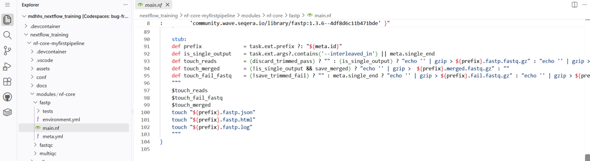

<br>

This is supposed to be a way to test the functionality and workflow logic of your pipeline without taking up a lot of time and/or space running the real commands, as in the real fastp tool defined in the bash script, above. We're not going to cover stub in this tutorial because I don't make much use of it. And, I think you should always test the true script out to ensure proper functionality. 

<br>

> [!NOTE] <br>
> Everything provided within this FASTP process is just default from the nf-core community. <br>
> As you'll soon see, we can edit the process to add/remove items. <br>
> nf-core CLI commands provide the template foundation, you edit as you please. 

<br>

Wow! That was a lot to take in. But don't worry, this will all make more sense as we begin to edit this FASTP process and incorporate the module into our pipeline. Let's get our hands (keyboards?) dirty!

Now, for any module (or subworkflow, which we'll learn in tutorial 5) we need to repeat the same **required** 3 steps to incorporate this newly added component into our overall workflow. And, there's 3 optional steps that can be edited, as well.

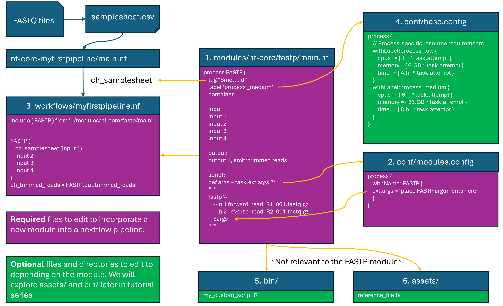

This figure summarizes the steps that we need to perform. The purple boxes are required and the green boxes are optional, depending on the module/subworkflow. Everything starts from the module (or subworkflow) that we add to the pipeline. <br>
In this case, the `modules/nf-core/fastp/main.nf` file needs to be edited with the correct `directives`, `inputs`, `outputs`, script `arguments`, and the `script` itself. 
- Many of the elements within this file refer to various others files/directories organized within a nextflow pipeline including: <br>
    * the `--input samplesheet.csv` that is transformed into a `meta` tagged channel 
    * modules configuration file (`modules.config`) <br>
    * computational resources configuration file (`base.config`) <br>
    * custom scripts (`bin/`) <br>
    * reference files or databases (`assets/`) <br>

Finally, this module needs to be explicitly defined within our `workflows/myfirstpipeline.nf` workflow. Let's work through each of these steps outlined in the figure. 

### FASTP module incorporation step 1

**Step 1.** Edit the main.nf file of the module or subworkflow of interest. Here, this module is `modules/nf-core/fastp/main.nf`

Here is snapshot of the beginning of the fastp main.nf file, prior to edits:

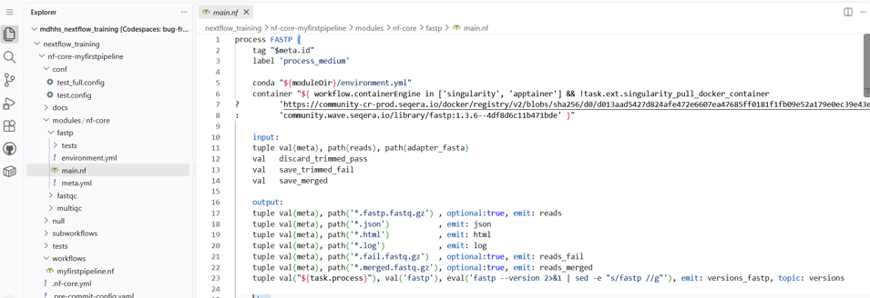

<br>

- Make the following edits <br>
    * Change label 'process_medium' to 'process_low' <br>
        - Our codespace is limited in computing resources (2 CPUs, 8 GB memory). We will check these resources in a bit to make sure our compute request settings match compute capability. <br>
    * Remove path(adapter_fasta) <br>
        - We will not add a custom adapter file. We'll rely on FASTP's internal adapter auto-detection. <br>
    * Change the emit channel for the trimmed reads from reads to trimmed_reads <br>
        - Just more intuitive since we're transforming raw reads to trimmed reads <br>

<br>

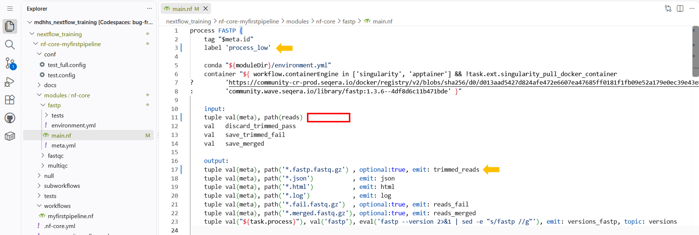

> [!NOTE] <br>
> The indentation is for aesthetic purposes only. It is not required as part of Nextflow syntax. <br>
> However, it does make it more human-readable. I do suggest adopting indentation practices as already shown in the template files. <br>

Okay, moving the down to the script section within the FASTP process. Let's look at a snapshot of the script, before edits:

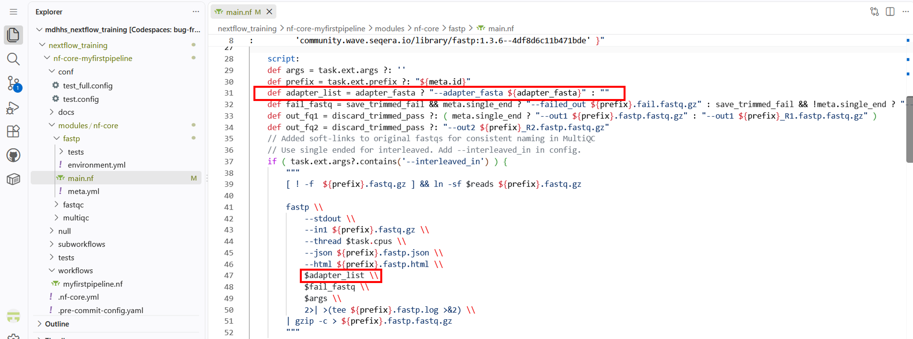

See those parts boxed in red? Let's get rid of them because we are no longer are adding a custom adapter file. It was removed from input and thus would error out the script if these parts were left in because the adapter_list variable would not be detected. 

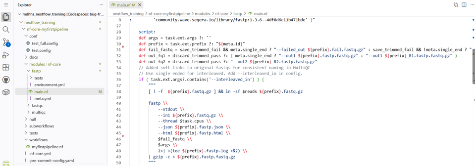

Awesome, almost there! The script is pretty long because of the `if-elseif-else statement`. We need to keep removing any presence of this adapter file. Scrolling down this script section a bit more:<br>

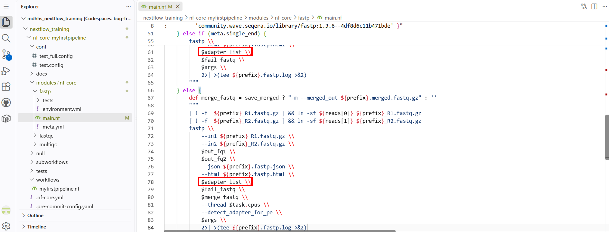

Again, remove the red-boxed code. 

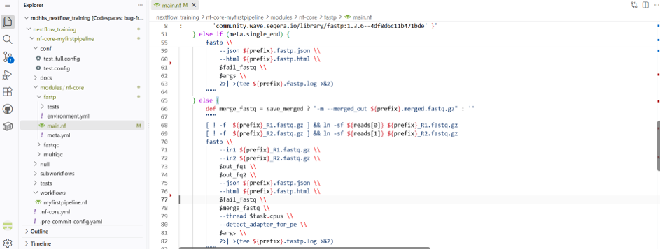

Edits are complete. Let's save the file: 

```
ctrl + s
```

### FASTP module incorporation step 2


**Step 2.** Edit `conf/modules.config` file to add tool-specific parameters

Open the modules.config file. This is what it should look like now: 

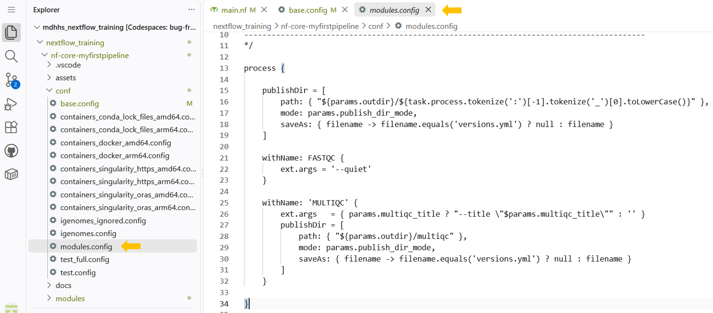

And add the following edits (green box in the image, below):

```
withName: FASTP {
    ext.args = '--cut_right --cut_window_size 4 --cut_mean_quality 20'
}
```

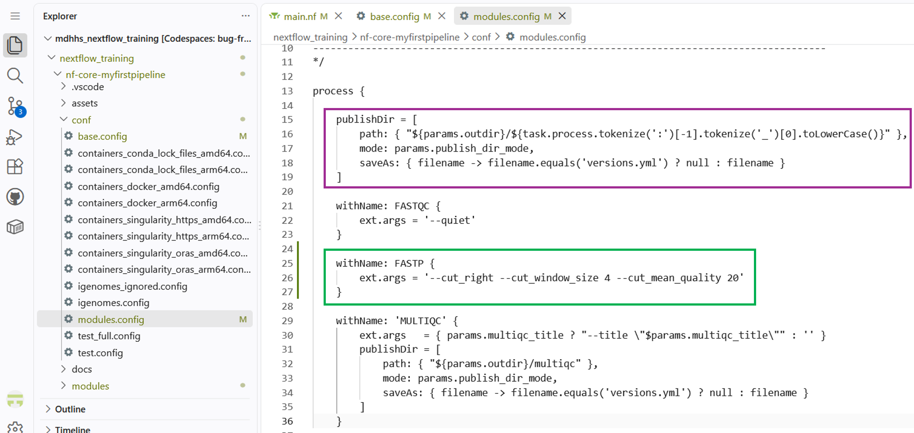

- Some things to note: <br>
    * all modules start with the `withName` line to reference the module itself <br>
    * Navigate back to the `modules/nf-core/fastp/main.nf` file and look for the line: <br>

        ``` 
        def args = task.ext.args ?: ''
        ```
        directly beneath the "script:" line. <br>

    * This line is looking for a `ext.args` argument inside the `modules.config` file
        - In practice, it can actually be defined in any config files but let's just focus on `modules.config` file for simplicity

FASTP arguments can be reviewed [here](https://github.com/opengene/fastp#filtering)

Why would tool arguments be separate from the `modules/nf-core/fastp/main.nf` file?

Take a moment to think about it and then check the possible answers:

<br>

<details>
<summary>Reveal solution, here</summary> <br>

1. It keeps the modules modular and shareable. the `modules/nf-core/fastp/main.nf` is generally a core template that anyone can use, whereas your unique pipeline parameters for all tools gets defined within `modules.config`. <br>

2. Easy access to all tool parameters. Instead of going through each main.nf file within the `modules/` directory to find specific parameters, it's all concisely organized within `modules.config`. <br>

3. What if you wanted to use a module twice within a pipeline, but with different arguments? This is possible with [module aliases](https://docs.seqera.io/nextflow/workflow#calling-processes-and-workflows) and its incorporation is provided as a guided challenge task at the end of this 2nd tutorial. 
</details>

<br>

Also note the:

```
publishDir = [
        path: { "${params.outdir}/${task.process.tokenize(':')[-1].tokenize('_')[0].toLowerCase()}" },
        mode: params.publish_dir_mode,
        saveAs: { filename -> filename.equals('versions.yml') ? null : filename }
    ]
```

At the top of the `modules.config` file (purple box in the image, above).

This is a global configuration setting for all modules part of your pipeline. 

- This `publishDir` directive is a way to specify output files from a pipeline. 
    - The first `path` line is organizing the output directory (defined by the `--outdir` parameter) with subdirectories created and named by each bioinformatics tool used in the pipeline, with the name converted to lowercase.
    - The second `mode` line defines how the results are taken from the `work/` directory and placed into your output directory. The most common setting for this is typically `copy`, meaning results will be copied from the `work` directory to your output directory. You can confirm this by finding this parameter with the global `nextflow.config` file (see image, below). 
    - The `saveAs` line controls whether a file is published to the output directory and can handle renaming. Here, we are basically saying, if we detect a file called versions.yml, do not publish it, otherwise publish all other output files to the output directory.  


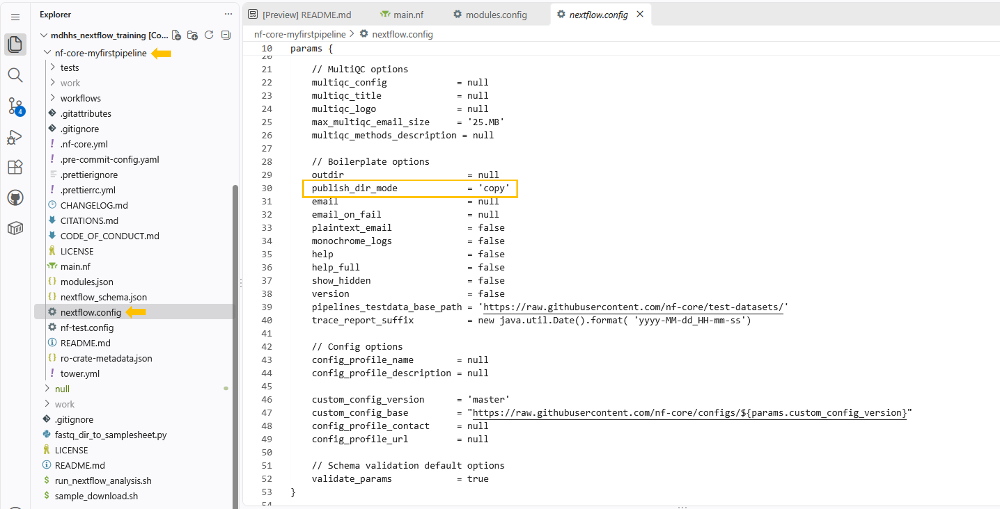

You can override the default `publishDir` settings by creating a `withName:` line and redefining the `publishDir` settings on a per module basis, as seen with the MultiQC module within the `modules.config` file, two images above. 


### FASTP module incorporation step 3

**Step 3.** Edit the `workflows/myfirstpipeline.nf` file to include the new module/subworkflow

Open the `workflows/myfirstpipe.nf` file. This is what it should look like now, at the beginning of the file: <br>

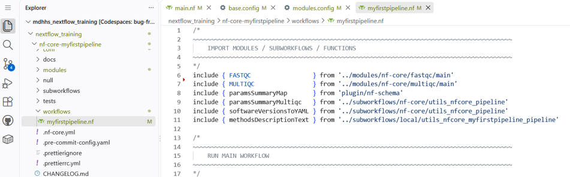 <br>

Remember when we first installed the FASTP module with the nf-core CLI. I mentioned to take note of something. What was that?


<details>
<summary>Reveal solution, here</summary> <br>
The following line: <br>

```
include { FASTP } from '../modules/nf-core/fastp/main'
```
</details>

<br>

You see, this is where we import all modules and subworkflows associated with our workflow. We need to add that line to include the FASTP module within our workflow, like so:

<br>

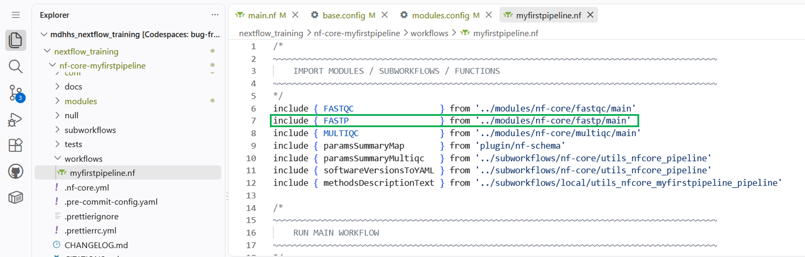

<br>

Now locate the section in the workflow where FASTQC is called:

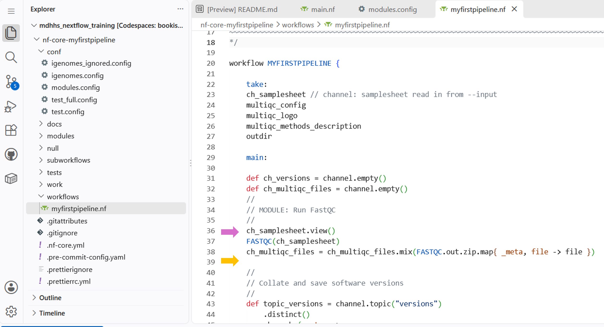 <br>

See that purple arrow? Add this line just above the FASTQC module:

```
ch_samplesheet.view()
```

Here, we are using the [view](https://docs.seqera.io/nextflow/reference/operator#view) operator to print the output of the channel `ch_samplesheet`. We basically want to look at what is represented by our `meta.id` tag.

And do you see that orange arrow in the image above? Let's place our FASTP module within this space, like so: 

> [!NOTE] <br>
> The location of these modules in "logical" order is not required but makes sense. <br>
> It's always best to make your workflow as human-readable as possible. <br>

<br >

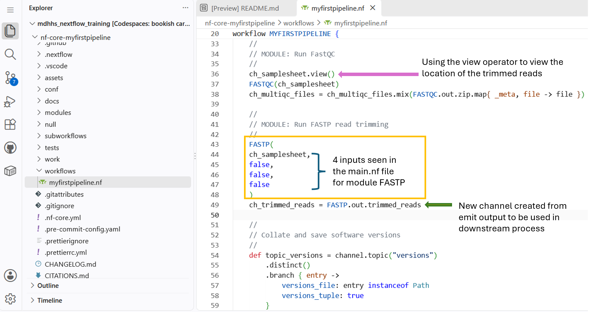

This is what was placed into the workflow:

```
//
// MODULE: Run FASTP read trimming
//
FASTP(
    ch_samplesheet,
    false,
    false,
    false
)
ch_trimmed_reads = FASTP.out.trimmed_reads
```

Let's focus on the inputs, first. We need the same number of inputs as declared within the `modules/nf-core/fastp/main.nf` file. 

- The expected input parameters for FASTP as defined by the nf-core community can be viewed [here](https://nf-co.re/modules/fastp/#input), and are discussed here, as well:
    - The first input expected was a tuple containing 3 qualifiers (the meta tag, the reads, and the adapter_fasta)
        - However, we edited the script to remove the adapter_fasta file so it now only expects a tuple with 2 qualifiers, so we can just keep it as the samplesheet
    - The second input is a boolean (true/false) declaration on whether we want to discard the trimmed reads (or not)
    - The third input is a boolean (true/false) declaration on whether we want to save reads that failed the trimmming thresholds
    - The fourth input is a boolean (true/false) declaration on whether we want to merge trimmed reads

> [!NOTE] <br>
> `//` in nextflow is equivalent to the `#` symbol in bash. <br>
> It is used for descriptive commenting within your script. <br>
> Not required but is good practice so others can understand your code. <br>


All we really care about is the trimmed reads so I input false for all of these (plus, they take up extra storage)

Next was specifying the channel containing our trimmed reads. Nextlow channel outputs from modules/subworkflows take the form of:

```
MODULENAME.out.emit_name
```

So in this case, our module was FASTP (captialized), "out" (as in output), and then whatever we name we gave after "emit:" within the output for the trimmed reads. Remember, we changed "reads" to "trimmed_reads". So putting it all together, it's:

```
FASTP.out.trimmed_reads
```

Here's another representation of it from the `modules/nf-core/fastp/main.nf` file:

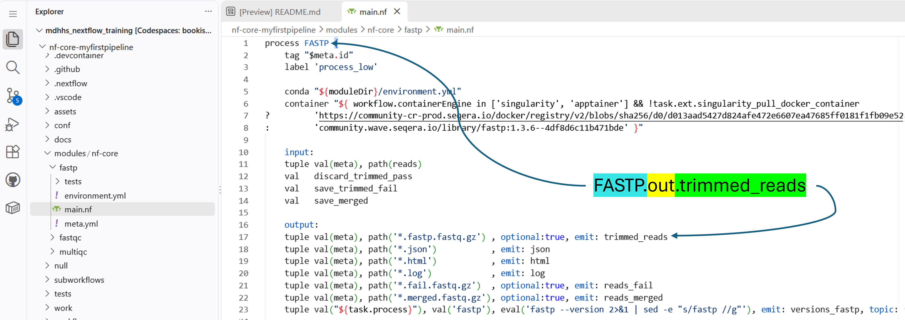

So that is how we access the output channel from a module process and use it for downstream processes in our workflow script. Now, it's not required, but I also chose to rename the channel, `FASTP.out.trimmed_reads` to `ch_trimmed_reads`, so that I know it's a (ch)annel.


### FASTP module incorporation step 4

**Step 4.** Adjust computing specifications because of the resource limitations of GitHub codespace

Edit the `conf/base.config` file so that all process labels have `2` CPUs and `6.GB` of memory:

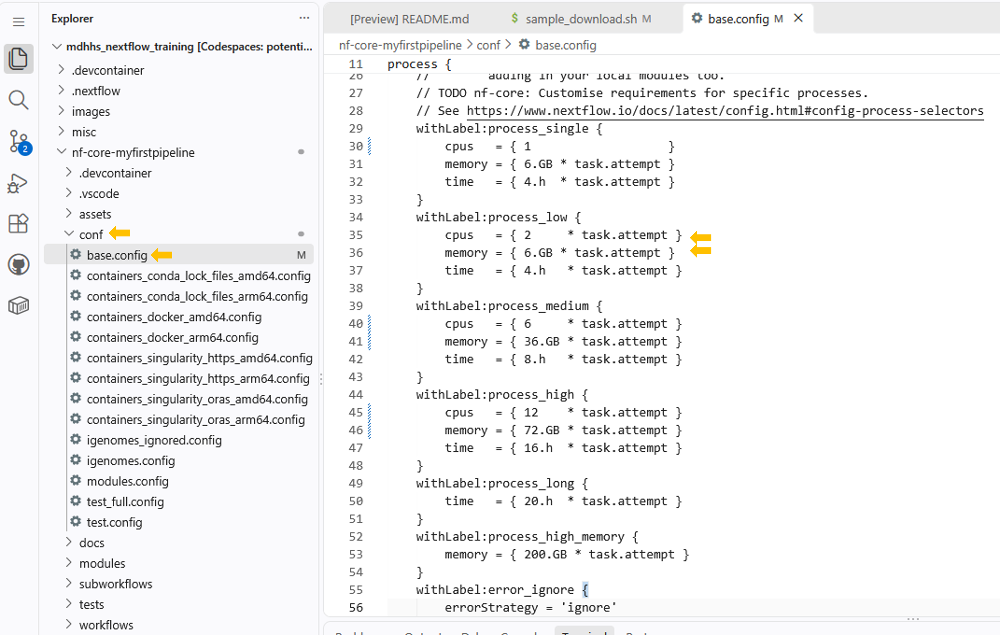

Again, this is a limitation to of GitHub codespace, in terms of computing power, so we need to make sure we stay within the computational bounds of our virtual machine. 

### Optional edits

At other points in this tutorial series, we will experience other edits that need to be made to our pipeline which may include: 

5. Adding external components associated with a module (e.g. reference file) to the `assets/` directory
6. Adding external scripts to the `bin/` directory


## Part III: Testing the pipeline


Navigate back to the launch directory: 

```
cd /workspaces/mdhhs_nextflow_training/nextflow_training
```

-You'll notice three files:
- sample_download.sh
    - similar commands as we ran in tutorial 1, but now contained within a shell script. 
    - The FASTQ files are now from a [measles WGS sequencing sample](https://www.ncbi.nlm.nih.gov/sra?LinkName=biosample_sra&from_uid=61933769)
- fastq_dir_to_samplesheet.py
    - The python script we used in tutorial 1 to create the `samplesheet.csv` file
- run_nextflow_analysis.sh
    - A bash script to run our nextflow pipeline


First, we need to change our sample. This was originally an *E. coli* sample but we want to download a measles sample. Open the sample_download.sh script and make the following edits:

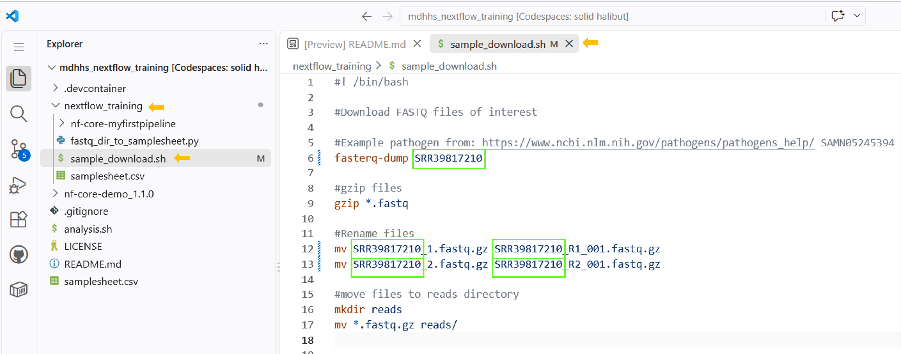


**All occurences of SRR3747659 should be replaced with SRR39817210**

Save the script:

```
crtl + s
```

And now, download the FASTQ files using the SRA Toolkit:


```
bash sample_download.sh
```

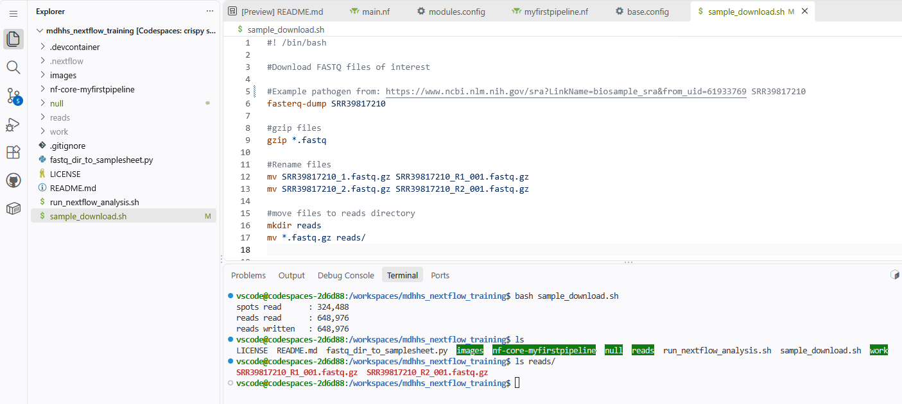

Prepare the samplesheet:

```
python3 fastq_dir_to_samplesheet.py reads/ samplesheet.csv
```

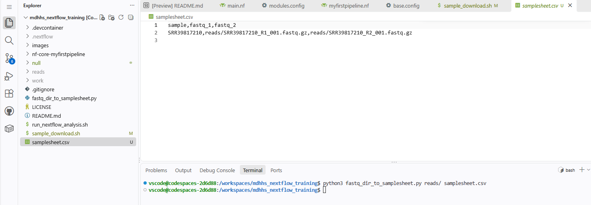


Edit the `run_nextflow_analysis.sh` file so that we're running the correct pipeline. Right now, the script still has the nf-core-demo pipeline specified: 

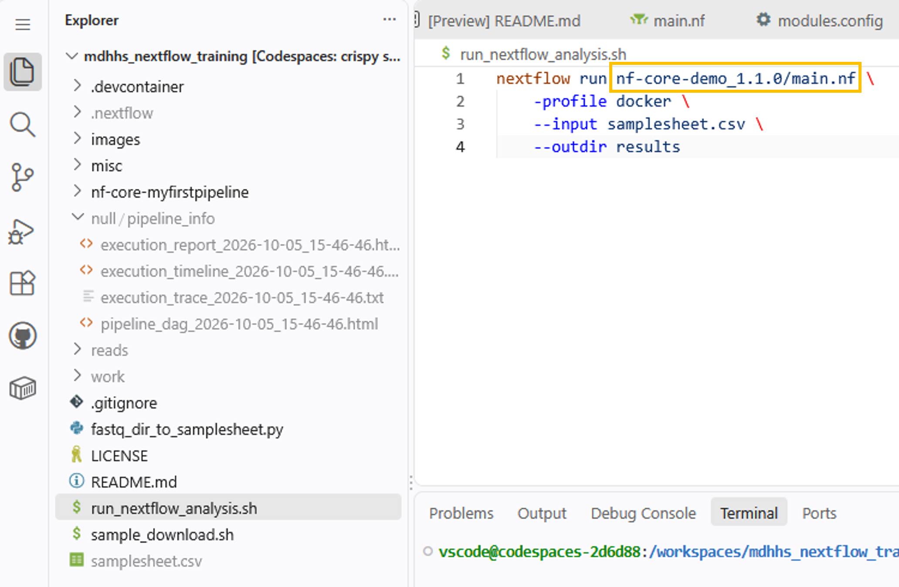

We need to replace `nf-core-demo_1.1.0/main.nf` with `nf-core-myfirstpipeline/main.nf`: 


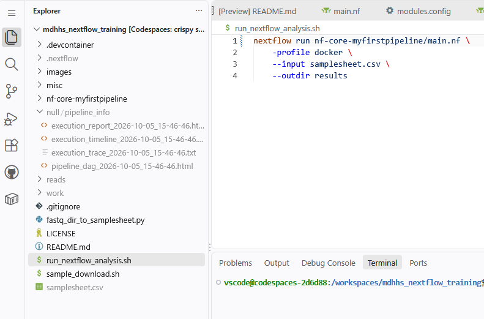


Now, start the pipeline

```
bash run_nextflow_analysis.sh
 
```

Wooo, the ourpipeline launched: 

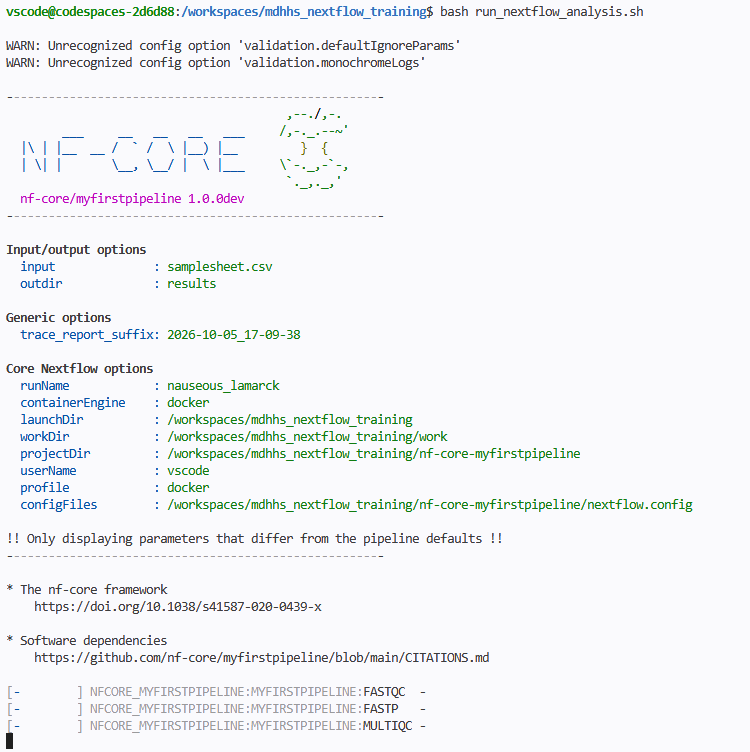


And succeeded: 

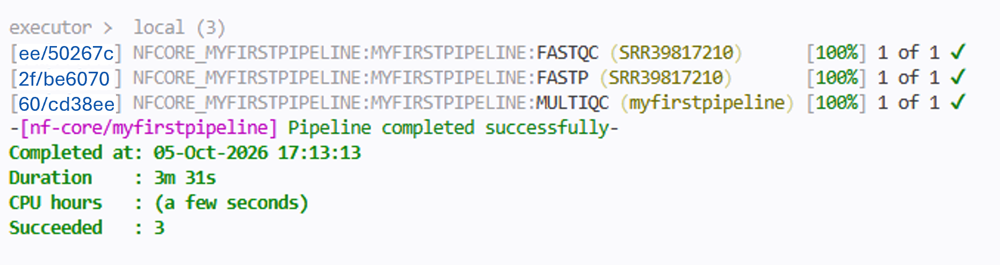


Convince yourself that you added the FASTP module successfully. Attempt to navigate to your work directory where the FASTP process occurred and was stored for our sample: 

```
cd work/unique_hash_to/fastp_process_directory
```

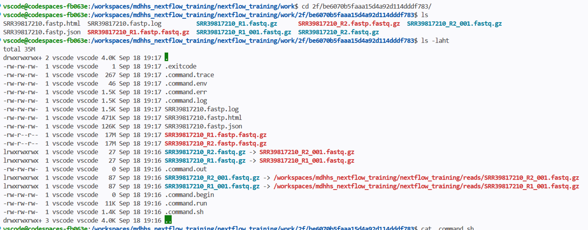

**Your hash will be unique and different from the one shown in the image.**

And view the command that was run:

```
cat .command.sh
```

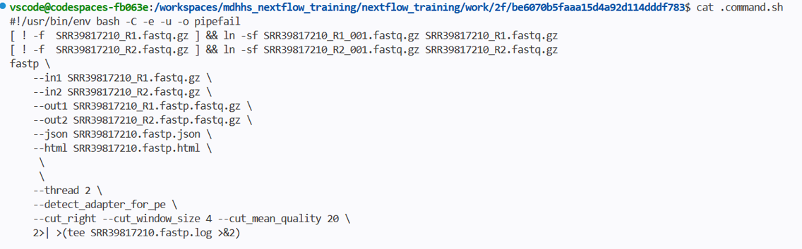

- As we can see:
    - It was the third script block run from the FASTP module, as we determined prior (refer to the "Exibit C" image)
    - Inputs and outputs match what is in the FASTP process script (`modules/nf-core/fastp/main.nf`)
    - Our FASTP paramaters were added from the `modules.config` file via `ext.args`


Awesome! But remember when we added the `view.()` operator to look at the contents of our samplesheet channel?

```
ch_samplesheet.view()
```

I'm not sure if you caught it but just after we launched the pipeline, you might have noticed this output:

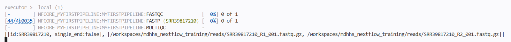


Do you see that? The line: 

```
[[id:SRR39817210, single_end:false], [/workspaces/mdhhs_nextflow_training/reads/SRR39817210_R1_001.fastq.gz, /workspaces/mdhhs_nextflow_training/reads/SRR39817210_R2_001.fastq.gz]]
```

This is the channel created from our `samplesheet.csv` file. We can see that it is a tuple, the first being the id, which is the `${meta.id}` tag that is added as a directive within the FASTP module. The second part is what ultimately becomes the `path(reads)` input, where this is a combined read pair. So when we reference `reads[0]`, we can access the forward read and when we reference `reads[1]`, we can access the reverse read.


Hopefully the `samplesheet.csv` > `ch_samplesheet` > `meta.id` > `tuple val(meta), path(reads)` connection is starting to make sense.

**This `meta.id` tag will hold for the remainder of the pipeline build and will be incorporated into every module we use. Again, this ties a unique sample ID to it's respective FASTQ read pair files**

### Troubleshoot error

In another nextflow run I tried for this pipeline, I ran into the following error:


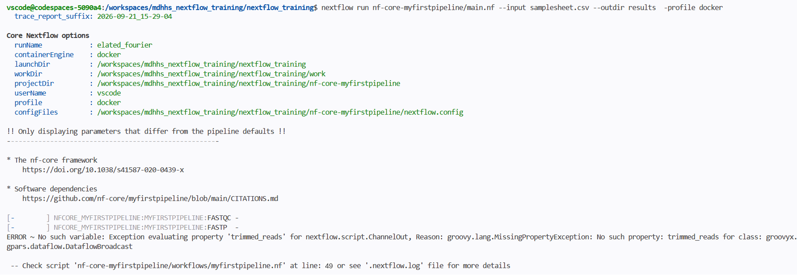


My `workflows/myfirstpipeline.nf` script looked like this:


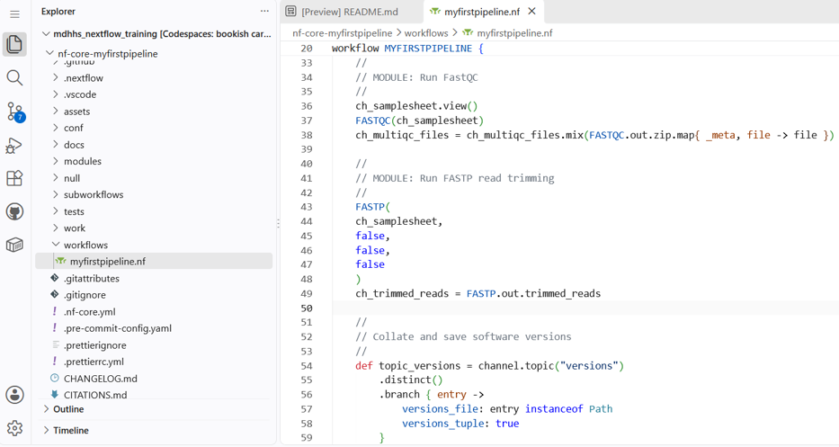

Okay, so we see at line 49 we have: 

```
ch_trimmed_reads = FASTP.out.trimmed_reads
```

And the error is stating that there is `No such property: trimmed_reads`


What do you think is the issue?

<br>

<details>
<summary>Reveal solution, here</summary>

<br>

I forgot to edit the emit channel in the `modules/nf-core/fastp/main.nf` script to match the `trimmed_reads` named channel output in my `workflows/myfirstpipeline.nf` (line 49):

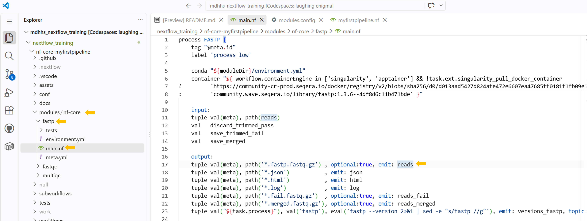

You see how I kept the emit channel for the trimmed reads as `reads`. `FASTP.out.trimmed_reads` is not an accessible output channel in the current state of my pipeline. I would need to edit this emit channel in `modules/nf-core/fastp/main.nf` to `trimmed_reads` for proper script functioning.  

</details>

<br>

# Recap 

- Congratulations! You just successfully added a module to your pipeline. In doing so, we learned:
    - How to use the nf-core CLI to add a module
    - The layout of a module file, specifically `modules/nf-core/fastp/main.nf`
    - How to incorporate the module into our workflow through editing of:
        - the module file itself: `modules/nf-core/fastp/main.nf`  
        - the workflow script: `workflows/myfirstpipeline.nf`
        - the modules parameter file: `conf/modules.config`
        - the computing configuration file: `conf/base.config`


In the next lesson, we will learn how to add a local module, aka add a module from scratch. In the meantime, expand your understanding of nextflow with the challenge below. You'll learn how to reuse a module within a pipeline. 

# Challenge: Adding a module alias

Navigate to the GitHub repo for the nextflow tutorial, [here](https://github.com/JLC2141/mdhhs_nextflow_training).

If you're relaunching your codespace, lauch the `tutorial_2_challenge` branch to have all progress made prior so that you can jump directly into this challenge. 

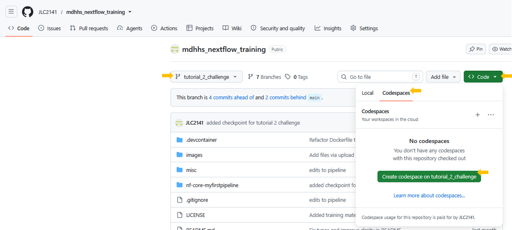

Refer to the pipeline image at the beginning of this tutorial. We typically run FASTQC on the raw reads and then again on the trimmed reads to make sure that our reads are better quality post-trimming. 

So let's do that! Edit the `workflows/myfirstpiple.nf` script and add the FASTQC module again just below our FASTP module:

```
FASTQC(ch_trimmed_reads)
```

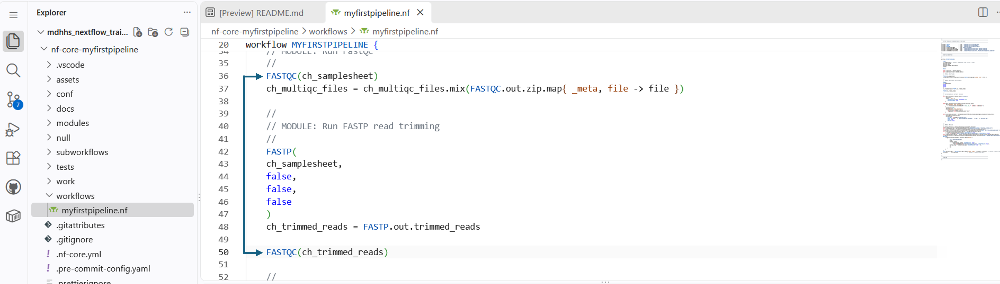

Notice this is slightly different from the first FASTQC module call. In the first FASTQC module, the input was `ch_samplesheet`. In this next run of FASTQ, we want to analyze our trimmed reads, so we use the channel output from the FASTP module, FASTP.out.trimmed_reads, that we renamed to `ch_trimmed_reads`.


Okay, so let's rerun our nextflow analysis:

```
bash run_nextflow_pipeline.sh
```

Ooo nooooo... we ran into an error:

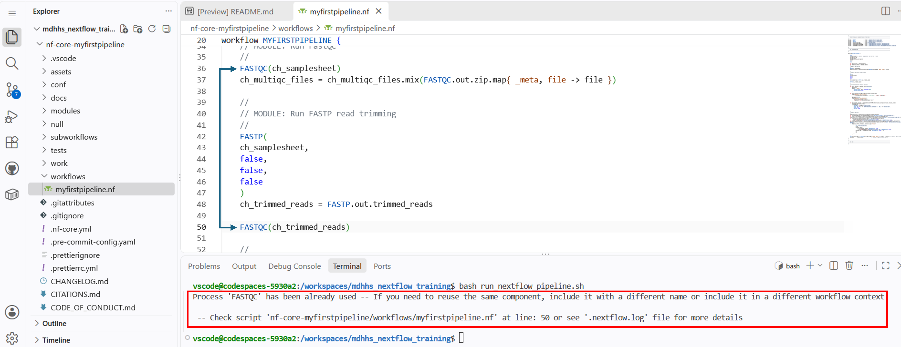

FASTQC has already been used and can't be used again in this manner. We will introduce the `module alias` functionality so that we can use the FASTQC module twice within our workflow.

At the top of the  `workflows/myfirstpiple.nf` script, where we import our modules/subworkflows, make the following edits.

Before:

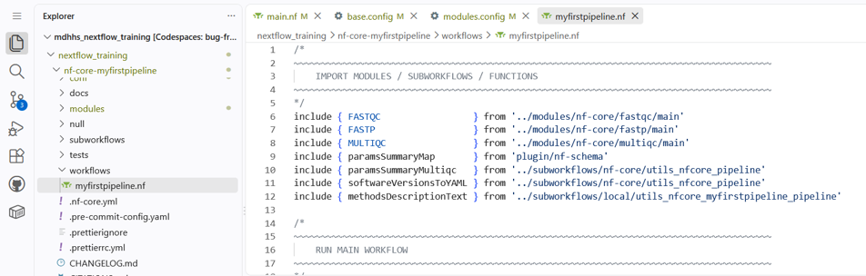


And after:

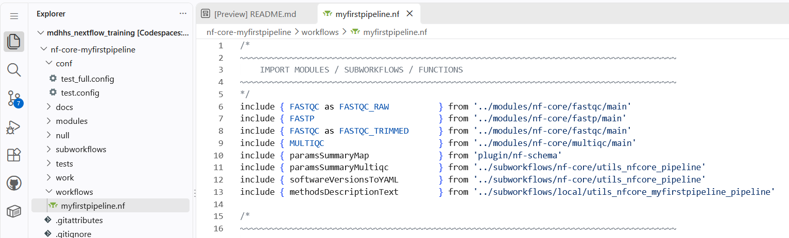

The original FASTQC import line was edit to:

```
include { FASTQC as FASTQC_RAW} from '../modules/nf-core/fastqc/main'
```

And an additional FASTQC import line was added:

```
include { FASTQC as FASTQC_TRIMMED} from '../modules/nf-core/fastqc/main'
```

The `FASTQC as FASTQ_module_alias` is the key part to successfully create a module alias. We can then refer to `FASTQC_RAW` and `FASTQC_TRIMMED` in our workflow to distinguish between these two modules. Let's continue editing our `workflows/myfirstpiple.nf` file. 


Also change the:

```
ch_multiqc_files = ch_multiqc_files.mix(FASTQC.out.zip.map{ _meta, file -> file })
```

<br>

to:

<br>

```
ch_multiqc_files = ch_multiqc_files.mix(FASTQC_raw.out.zip.map{ _meta, file -> file })
```

<br>

We will learn about this more in tutorial 6 when we learn MultiQC but for now, just make the change so that the pipeline runs. 


#FASTQC module aliases run but have same results output

Technically the pipeline ran and was "sucessful", but is everything as expected? Check out your results? What do you notice is wrong?

<details>
<summary>Reveal solution, here</summary>
There is only one output for FASTQC, so the results from the raw reads must have been overriden by the trimmed reads after FASTQC was run again.

</details>


