# Table of contents
- [Overview](#-overview)
- [Tutorial 1](#-tutorial-1)
- [Part I](#part-i-launching-codespace-and-installing-tools)
- [Part II](#part-ii-obtaining-a-pipeline-from-nf-core-command-line-interface-cli-and-preparing-a-run)
- [Part III](#part-iii-creating-your-first-nextflow-pipeline-with-nf-core-cli)
- [Recap](#recap)


# 📖 Overview

In session 1 of this tutorial series, we will learn how to obtain pre-built pipelines from the community and run them. 

Learning objectives:

* Understand how to install nextflow and associated tools
* Download an nf-core pipeline and prepare the components needed to run the nextflow pipeline
* Explore and familiarize yourself with nextflow outputs and functionality
* Experience and troubleshoot nextflow errors
* Creating a new nextflow pipeline with nf-core CLI

# 📖 Tutorial 1


# Part I: Launching codespace and installing tools

### Launching the nextflow tutorial on GitHub Codespaces

**Make sure that you are signed-in to your GitHub account.**

Navigate to the GitHub repo for the nextflow tutorial, [here](https://github.com/JLC2141/mdhhs_nextflow_training).

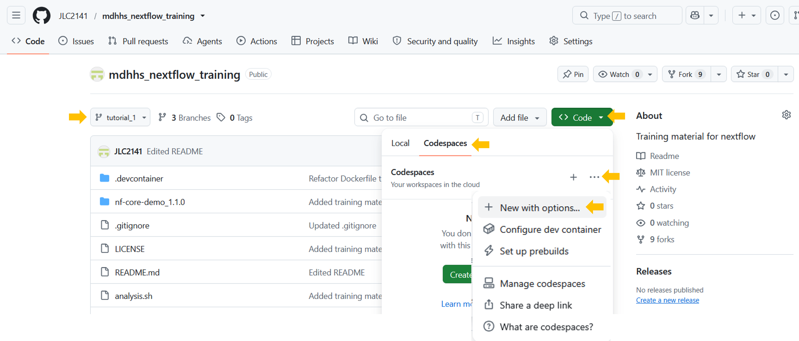

Select the branch icon on the left. It should currently say `main`. Select `tutorial_1` and the page should reload. Once confirmed, select the green <> Code icon, the Codespaces tab, the ellipsis, and then select "New with options...". 


Make sure that the branch selection is `tutorial_1`. Select the options for "Machine type". Select the 2-core option but before you do, take note of the virtual machine (VM) that we're about to create. 

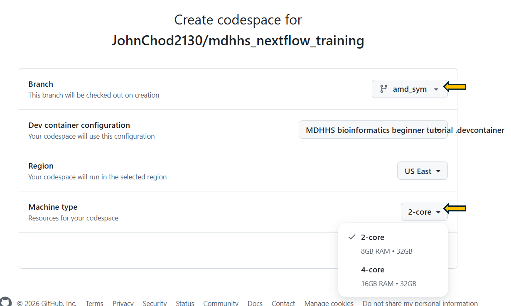

How many CPUs? How much memory will our VM contain?

<details>
<summary>Reveal solution, here</summary>
2 CPU cores
8 GB of RAM

We will need to make use of this information later in this tutorial so keep that this information in mind!
</details>

Finally, create the codespace

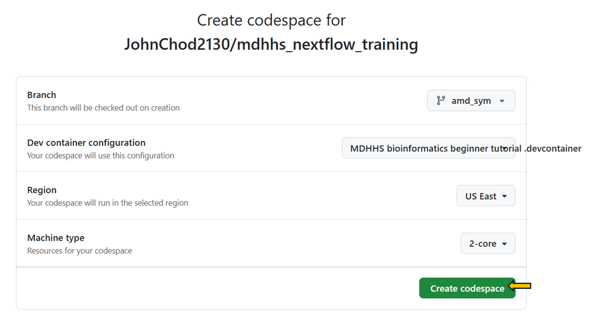

A new codespaces session will launch. It will take a few minutes for the set up to complete. A prompt may appear as such:

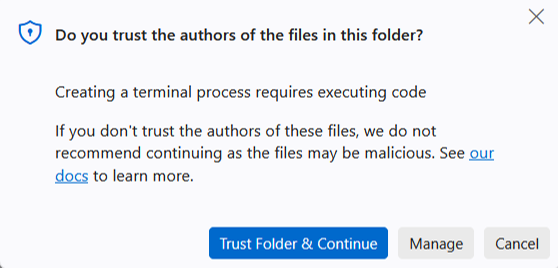

Select "Trust folder & continue". Once codespaces creation is completed, you should see the file explorer panel on the left and the terminal in the lower panel:

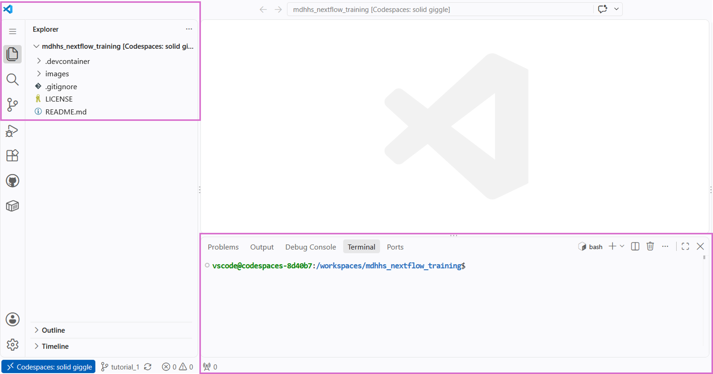

If you do not see the terminal, press F1. You'll be prompted on the search bar. Type the following, "View:toggle terminal", and select that option. 

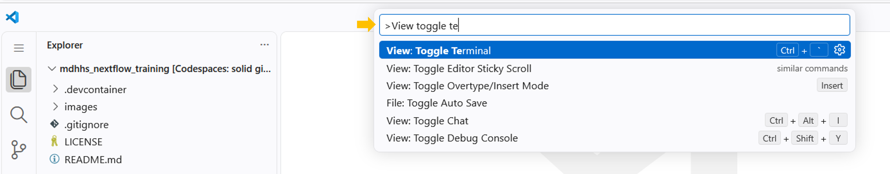

> [!NOTE] <br>
> The greater-than symbol is needed in order to switch from file search mode to command mode.

<br>

Alright! Our codespace is properly loaded. Let's install what we need to start using nextflow.

<br>

### Installing Nextflow

Instructions for installing nextflow can be found, [here](https://docs.seqera.io/nextflow/install)

Requirements prior to nextflow installation include:

1. Java 17 (or later, up to 26)
2. Bash 3.2 (or later) 

These have already been installed for you but let's confirm the versions:

```
java -version
bash -version
```

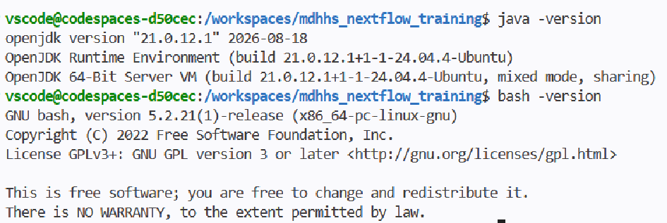


Great! Open source java (openjdk) is v21 and bash is v5. We have what we need to install nextflow!

<br>

> [!NOTE] <br>
> The previous instruction was contained within a code block. In your own time, I encourage you to type the commands yourself but, <br>
> for purposes of convenience, feel free to use the code blocks to copy and paste the commands into your codespaces terminal.

For example, navigate back to the GitHub repo, [here](https://github.com/JLC2141/mdhhs_nextflow_training). 

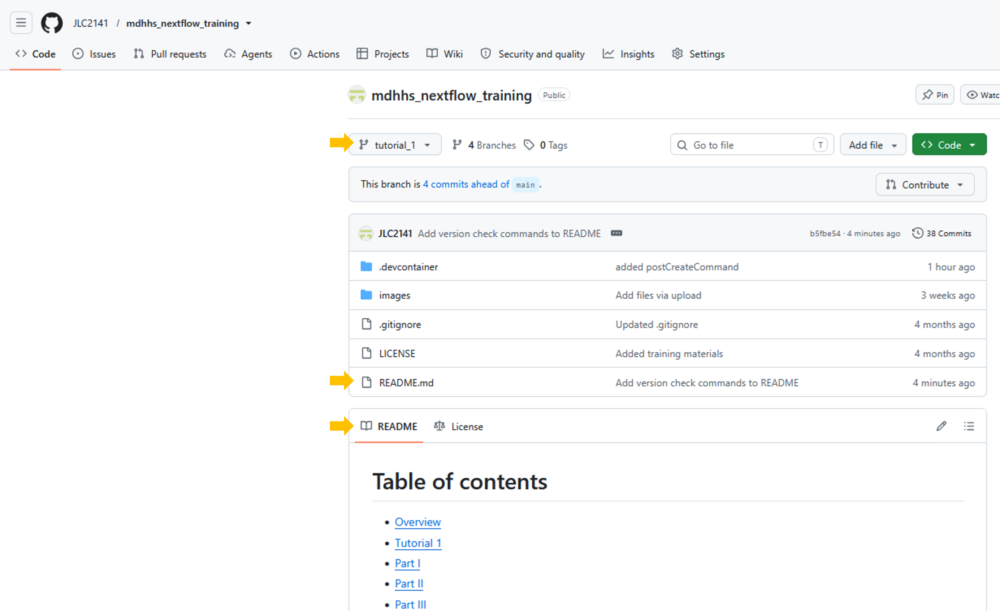

**Make sure you select the `tutorial_1` branch**. When the page reloads, it automatically loads the README.md file in the webpage.

> [!NOTE] <br>
> This README.md file is also organized for asynchronous learning. <br>

Scroll down and locate the previous code block in the README.md file. 

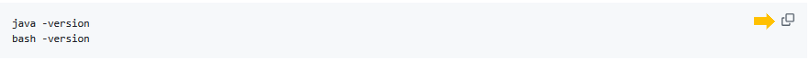

You can click on the icon at the right of the code block to copy the code, and then paste the code in your terminal. 

<br>

Back to the tutorial:

Use the curl command to retrieve the nextflow executable: 

```
curl -s https://get.nextflow.io | bash
```

You should now see `nextflow` in your current directory (`/workspaces/mdhhs_nextflow_training`). Let's make it executable:

```
chmod +x nextflow
```

Now, for organizational purposes, we will move the nextflow executable into a `.local/bin/` directory within our `HOME` directory. 

```
mkdir -p $HOME/.local/bin/
mv nextflow $HOME/.local/bin/
```

Let's attempt to see what nextflow version we downloaded:

```
nextflow -version
```

Ah, an error: 

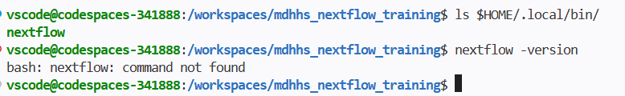

The command is not found even though we confirmed that it's in our `$HOME/.local/bin` directory. Take a moment to think why this is happening. For example, see if this works:

```
$HOME/.local/bin/nextflow -version
```

<details>
<summary>Reveal solution, here</summary>

If we just want to use the nextflow executable without providing the full path, then we need to make sure that the path to the nextflow executable (`$HOME/.local/bin`) is in our `$PATH` variable. Let's check:  

```
echo $PATH
```

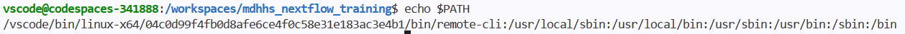


You see, it is not currently there and therefore not an automatically searchable path. Let's add the path to the nextflow executable to our `$PATH` variable.  

```
export PATH="$PATH:$HOME/.local/bin"
```

And then re-check the nextflow version only using `nextflow` without the full path.

```
nextflow -version
```

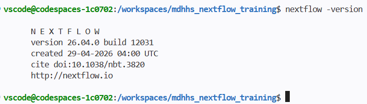

Great, it works! Nextflow is now installed!

</details>


### Installing nf-core

We're going to install nf-core with `pip`, as outlined in the nf-core [documentation](https://nf-co.re/docs/nf-core-tools/cli/installation#install-with-pip) 

```
pip3 install --break-system-packages nf-core==4.0.2
```

`pip` is a python package management system used to install packages. We used `pip3` because it is the python3 alias. We have python 3.12.3 installed in this container. 

And we had to add the `--break-system-packages` flag to allow this to be installed while inside our container. This likely would not be needed if you were trying to install this on your system. 

Try to invoke the nf-core command line interface (CLI):

```
nf-core
```

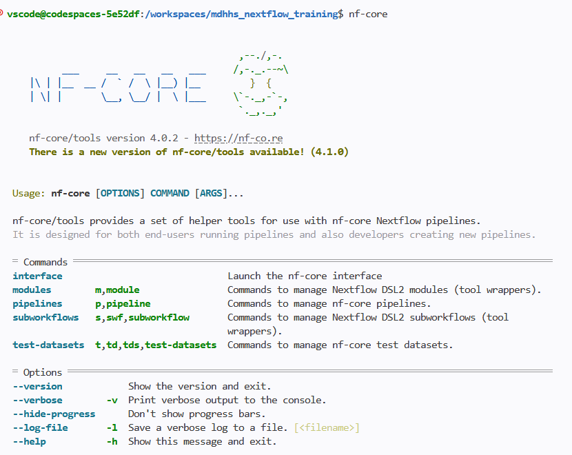

Success! One more tool to install.

But before that, you may be asking yourself, what is nf-core, short for nextflow-core? Briefly, [nf-core](https://nf-co.re/docs/get_started/nf-core) is a global community setting strict, best practices for building nextflow pipelines. Not only do they have a curation of community-built [pipelines](https://nf-co.re/pipelines/) freely available for the public to use, they also have a command line interface (CLI) that one can use to obtain nf-core pipelines (as we'll see in Part II) and build nextflow pipelines (as we'll make use of in the remaining tutorials part of this training series).

### Installing SRATools

[SRATools](https://github.com/ncbi/sra-tools) is used to download files from the SRA repository. 

Use `wget` to retrieve the gzipped tarball file:

```
wget -q https://ftp-trace.ncbi.nlm.nih.gov/sra/sdk/3.3.0/sratoolkit.3.3.0-ubuntu64.tar.gz
```

Untar the file: 

```
tar -xvf sratoolkit.3.3.0-ubuntu64.tar.gz
```

Remove the original gzipped tarball file to clear storage space:

```
rm sratoolkit.3.3.0-ubuntu64.tar.gz
```

And finally, let's also move this into our `$HOME` directory and export the path the the SRA toolkit bin to our `$PATH` variable:

```
mv sratoolkit.3.3.0-ubuntu64/ $HOME/
export PATH="$PATH:$HOME/sratoolkit.3.3.0-ubuntu64/bin"
```

Awesome! Now we have everything we need to start running nextflow pipelines. 


## Part II: Obtaining a pipeline from nf-core command line interface (CLI) and preparing a run


### Use nf-core CLI to download the nf-core-demo pipeline

Let's confirm that we're in our launch directory (`launchDir`), which I'm defining as `/workspaces/mdhhs_nextflow_training`. And soon nextflow will define this for us, as well. 

We will first start by downloading our pipeline of interest. And to do this, we will make use of the [nf-core CLI](https://nf-co.re/docs/nf-core-tools). Check out the link. nf-core commands will always start with nf-core, followed by 1 of 4 categories (modules, pipelines, subworkflows, test-datasets), followed by a command within that category. For example, on your terminal, type: 

```
nf-core pipelines
```


And you can see that we have 4 additional subcommands that we can use. Let's go a step further with a subcommand and type:

```
nf-core pipelines list
```
Scroll through the list until you find the nf-core demo pipeline:

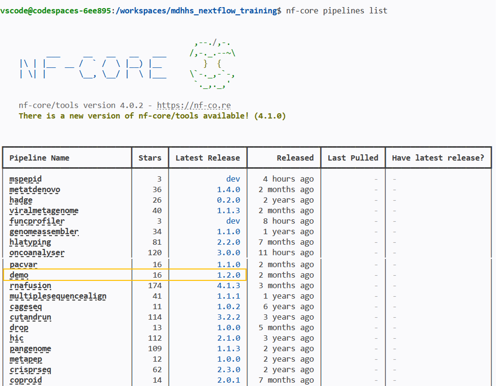

There it is! Okay, let's go another step further and download this pipeline to our computer:

```
nf-core pipelines download
```

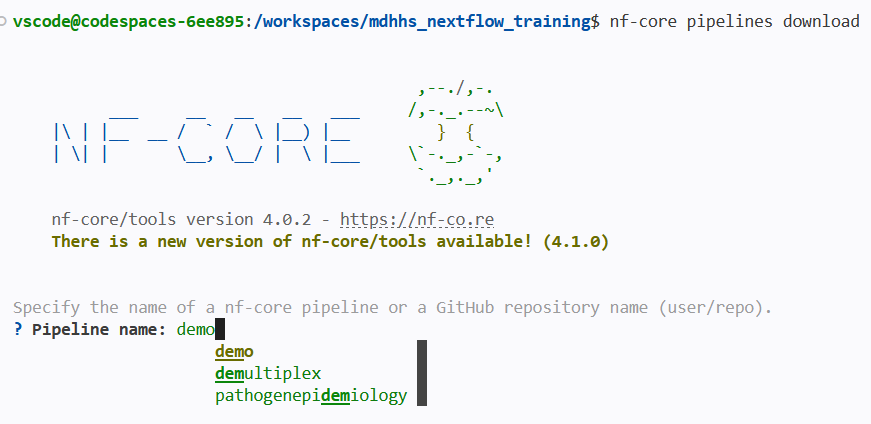

You'll be prompted to enter a pipeline name. Type it all out or use the arrow keys and hit enter to select the demo pipeline. Use the arrow keys to navigate to and enter the pipeline version that you want to download:

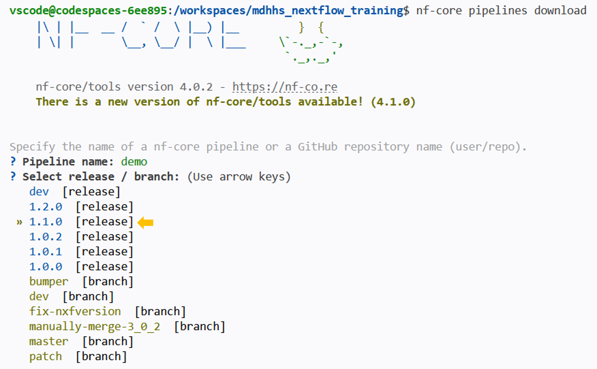

Let's go ahead and select the 1.1.0 release. Next, you'll be prompted if you want to download the containers:

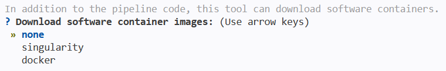

Select "none". Finally, you'll be prompted for compression type:

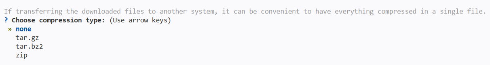

Select "none". If the nf-core pipeline download was successful, you should see the following information along with a new directory containing your nf-core-demo_1.1.0 pipeline:

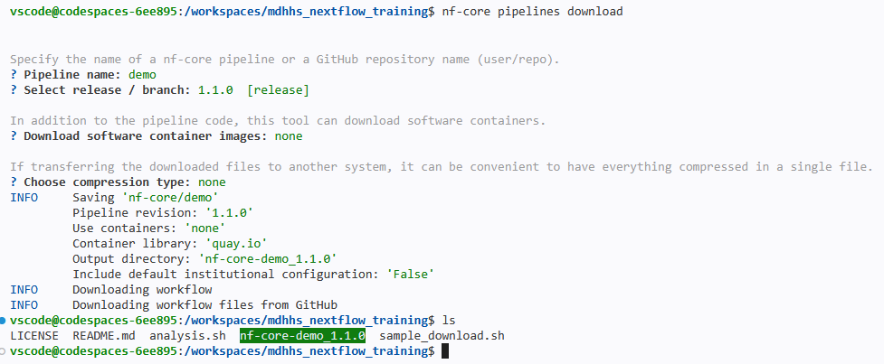

Explore the file/directory structure: 

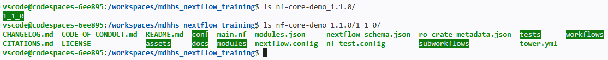

We will get into more details as we build our own pipeline but briefly: 

main.nf: required in order for the nextflow run command to function <br>
nextflow.config: global pipeline configuration properties <br>
assets: storage of reference files and databases <br>
conf: pipeline-specific and computational configs <br>
modules: bioinformatic tools installed here <br>
subworkflows: collection of modules into a "mini workflow" <br>
workflows: a script (per workflow) containing all modules/subworkflows in your pipeline <br>

### Download FASTQ files and reorganize our directory structure

Great! That was step 1. Step 2, we need to obtain our sample of interest. Download our tutorial dataset using the [SRA Toolkit](https://github.com/ncbi/sra-tools/wiki/HowTo:-fasterq-dump):

> [!NOTE] <br>
> Like nf-core, SRA Toolkit also has built in CLI commands.
> And that's what we're using here to retrieve FASTQ files.

```
fasterq-dump SRR3747659
```

> [!NOTE] <br>
> fasterq-dump is a more up-to-date command compared to fastq-dump, but in contrast to fastq-dump, 
> fasterq-dump does not have a built in --gzip/pigz option. So we need to perform this ourselves.

```
pigz *.fastq
```

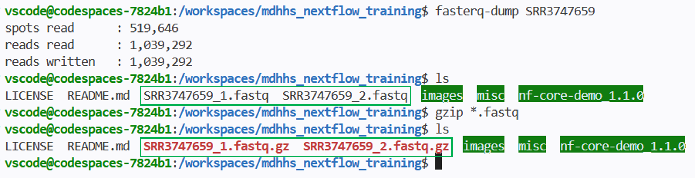


Let's reorganize or FASTQ files into a reads directory

```
mkdir reads
mv *.fastq.gz reads/
```

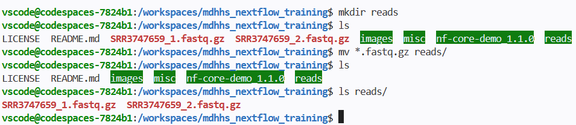

### Samplesheet creation

Step 3, we need to make our samplesheet. This is a `CSV` file that typically takes the form of:

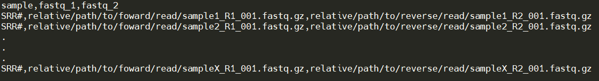

Typically three columns, where the first column represents the SRR accession number (or any unique sample identifier based on your FASTQ file naming scheme) and second and third columns provide the relative paths to the forward and reverse reads for a given sample, respectively. Rows are added for each sample in your analysis. 

Now, say you had 100+ samples to analyze. This CSV file will be tedious to create. So we automate this with a script. In addition to automation, I prefer to not reinvent the wheel. There is a script already available from the nf-core community that automates samplesheet creation. Let's obtain this python script from the [nf-core viralrecon pipeline](https://github.com/nf-core/viralrecon/tree/2.6.0):

```
wget -L https://raw.githubusercontent.com/nf-core/viralrecon/master/bin/fastq_dir_to_samplesheet.py
```

And then look at the help information for the python script:

```
python3 fastq_dir_to_samplesheet.py -h
```

> [!NOTE] <br>
> Python3 was installed in this codespace we're currently using so we use the `python3` prompt instead of `python` to invoke the script

<br>

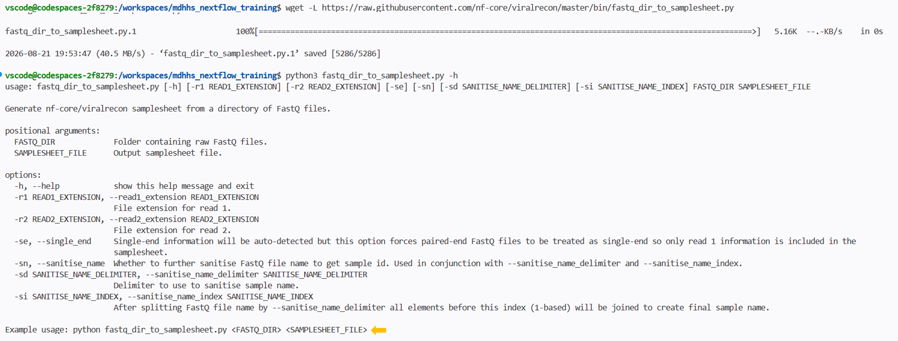

We can see that the path to the FASTQ directory and name of our samplesheet are required inputs, along with other [optional] options. Go ahead and attempt to create the samplesheet as such: 

```
python3 fastq_dir_to_samplesheet.py reads/ samplesheet.csv
```

Ope, we ran into an error! 

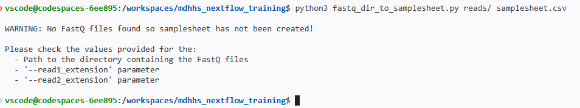

It states that no FASTQ files were found and then states that we need to check our read extension parameters. On the file explorer panel, open the fastq_dir_to_samplesheet.py script. Take a moment to try to figure out what is wrong. 

<br>

<details>
<summary>Reveal solution, here</summary>
The python script, by default, expects read 1 and read 2 extensions to be "_R1_001.fastq.gz" and "_R2_001.fastq.gz", respectively. <br>
However, our current read 1 and read 2 extensions are "_1.fastq.gz" and "_2.fastq.gz", which is why the script is not finding our FASTQ files.

<br>

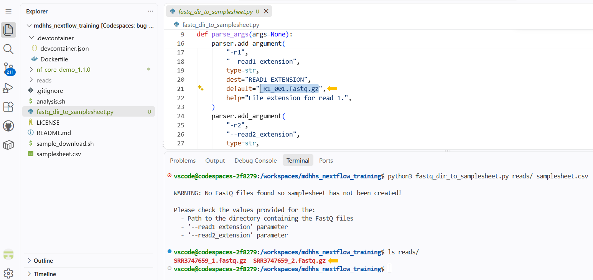

</details>

<br>

We have 1 of 2 options here:
1) Add additional parameters, `--read1_extension "_1.fastq.gz" --read2_extension "_2.fastq.gz"`, to our python3 fastq_dir_to_samplesheet.py call
2) Change the extension of our FASTQ files to conform with the expected default

I'm going to take option 2, because it better conforms to standard naming conventions within the sequencing community and, we don't typically obtain FASTQ files from SRR. <br>
We routinely obtain FASTQ files from BaseSpace, which normally outputs FASTQ files with "_R1_001.fastq.gz" (forward read) and "_R2_001.fastq.gz" (reverse read) extensions. 

Change into the reads directory and change the file names:

```
cd reads/
mv SRR3747659_1.fastq.gz SRR3747659_R1_001.fastq.gz
mv SRR3747659_2.fastq.gz SRR3747659_R2_001.fastq.gz
```

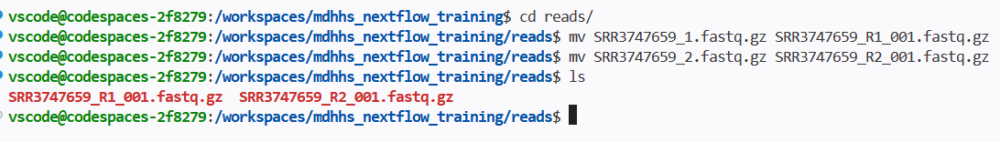

Return to the `launchDir` directory (`/workspaces/mdhhs_nextflow_training`) and try re-running the script

```
#Returning to the launchDir, from /workspaces/mdhhs_nextflow_training/reads/
cd ..
```

Rerun the samplesheet creation script:

```
python3 fastq_dir_to_samplesheet.py reads/ samplesheet.csv
```

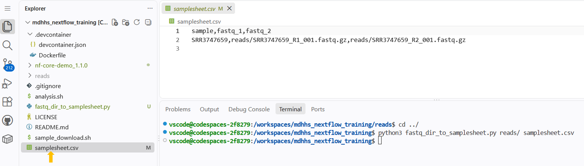

Beautiful! Now it seems to have worked. If we select the samplesheet.csv file from the file explorer pane, we should now see that the relative paths to the forward and reverse reads are in the reads/ directory with the "_R1_001.fastq.gz" and "_R2_001.fastq.gz" extensions, respectively. 


### Run the nf-core-demo pipeline

Now, the 4th and final step of this nf-core demo pipeline is to simply run it:

```
nextflow run nf-core-demo_1.1.0/1_1_0/main.nf -profile docker --input samplesheet.csv --outdir results
```

Ope! You'll like run into an error that states this:

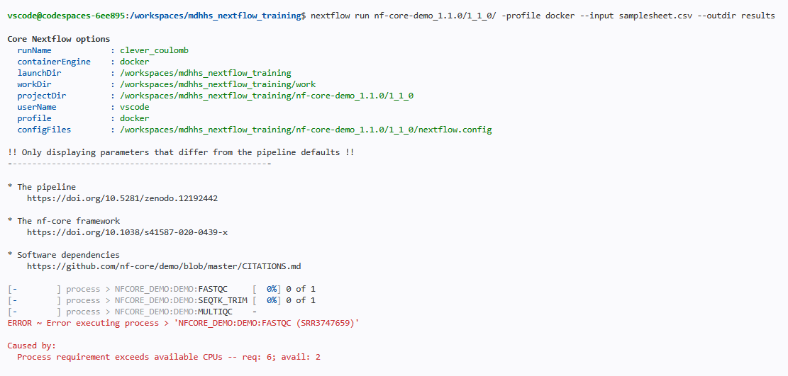

<br> or this:

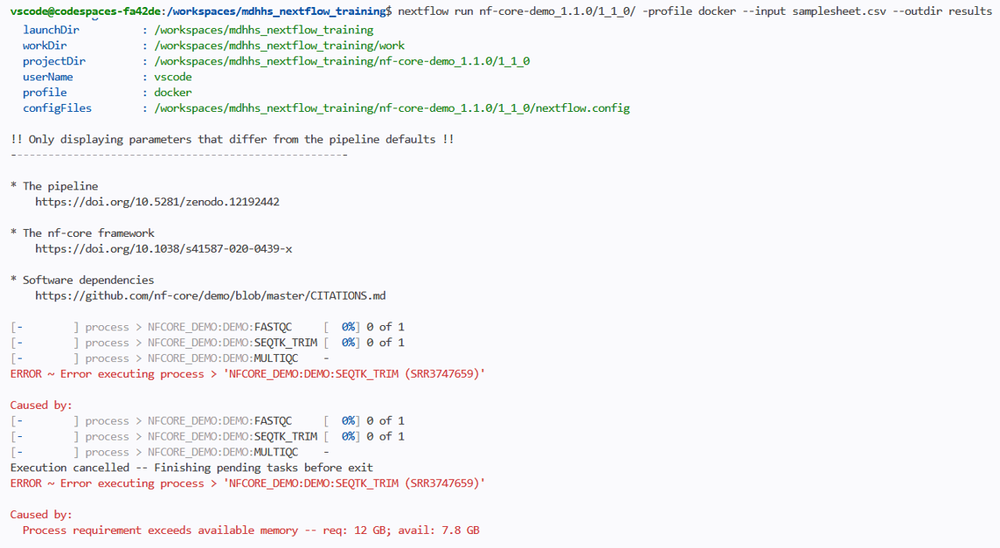

The main errors being either `Process requirement exceeds available memory` or `Process requirement exceeds available CPUs`

### Alter the nextflow conf/base.config file to conform to CPU and memory availability on our VM

We need to perform an additional step because of the computational limits of codespace.  

Can you recall what how many CPUs and memory is provided by our virtual machine that we previously launched via GitHub codespace?

<br>

<details>
<summary>Reveal solution, here</summary>
2 CPU cores
8 GB of RAM
</details>

<br>

We need to place computational limits on our nextflow processes in a way that reflects the limits of our computing power. Select on the base.config file contained within `nf-core-demo_1.1.0/1_1_0/conf/`:

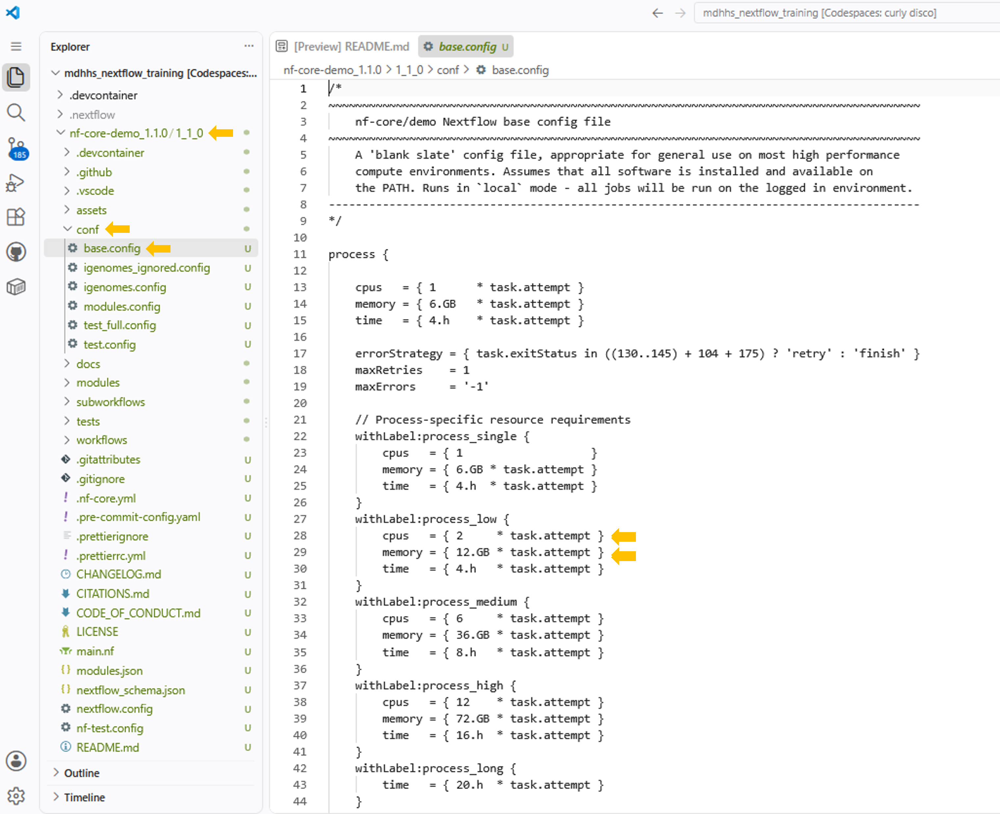

Alter the following lines so that CPU is changed to 1 and memory is changed to 6.GB

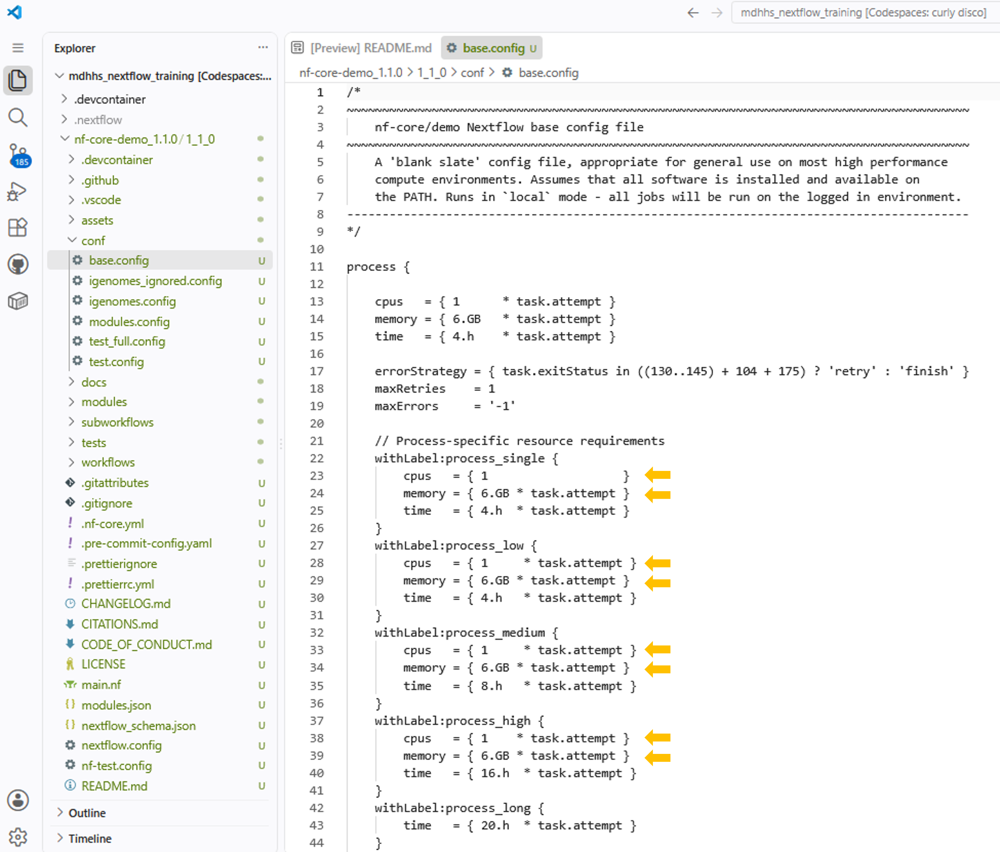

And save the file:

```
ctrl+s
```
> [!NOTE] <br>
> I apologize that we're getting a bit into the weeds here but this will all become clearer in the following tutorials <br>
> For now, I just want to get the pipeline running so we can explore nextflow outputs and basic functionality before we start building our own nextflow pipeline in the remaining tutorials

### Reattempt nextflow pipeline execution and explore the `nextflow run` command

Now again, from our launch directory (`launchDir`), `/workspaces/mdhhs_nextflow_training`, let's try to run the pipeline again: 

```
nextflow run nf-core-demo_1.1.0/1_1_0/main.nf -profile docker --input samplesheet.csv --outdir results
```


This command should have just successfully launched the nextflow pipeline. *At the bare minimum*, a nextflow pipeline requires:

1) `nextflow run`
    * the execution command
2) the pipeline of interest that we want to run, providing a relative path to the `main.nf` file (`nf-core-demo_1.1.0/1_1_0/main.nf`)
3) The profile core option, specifying a containerEngine (`-profile docker`)
4) The input samplesheet.csv file, providing the paths to the FASTQ files (`--input samplesheet.csv`)
    * as we just made from our downloaded FASTQ files obtained from SRA
5) An out directory (outdir) where we want to write the results (`--outdir results`)

<br>

> [!NOTE] <br>
> The profile option has 1 dash while the input and outdir parameters have 2 dashes. <br>
> Nextflow core options contain 1 dash. This affects the behavior of nextflow itself. <br>
> Pipeline parameters, that affect a single workflow, is specified with 2 dashes. <br>
> We'll explore another nextflow core option in a second. <br>

<br>

When nextflow launched, you should have seen the following:

<br>

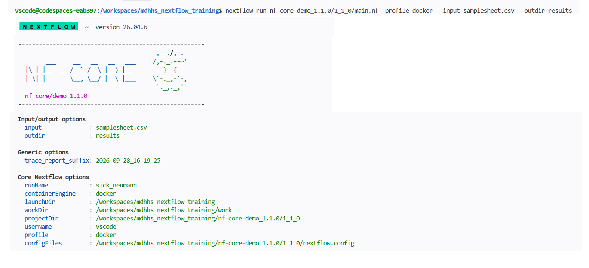

We see a number of things upon the launch:

1) The nextflow version and a message providing the pipeline we launched,
2) Input/output options
    * We see an input samplesheet and a results out directory specified
3) Generic options
    * A time stamp to trace some of the output reports
4) Core Nextflow options
    * runName: randomly assigned. Here, I was given "sick_neumann"
        - A unique session ID is provided with each nextflow run. Nextflow provides a human-readable name to simplify referencing it.
    * containerEngine: nextflow supports various [engines](https://docs.seqera.io/nextflow/container#container-runtimes) but the most common are docker and apptainer.
    * launchDir: path to where we launched the pipeline from (As mentioned before, I already started referring to this as the launch directory for purposes of consistency).
    * workDir: path to where the work directory was created. We'll explore this concept in a second.
    * projectDir: path to the nextflow pipeline of interest.
    * userName: Your user name. This was assigned to you during this tutorial creation. 
    * profile: redundant with containerEngine but this is also an input parameter specfied when we submit the command to run nextflow.
    * configFiles: we will learn about [configuration files](https://docs.seqera.io/nextflow/config) in subsequent lessons, but briefly, these allow you to control how your pipeline runs without changing the underlying code. 


### Exploring the nf-core-demo results

Your pipeline should have completed by now. If so, you should see the following:

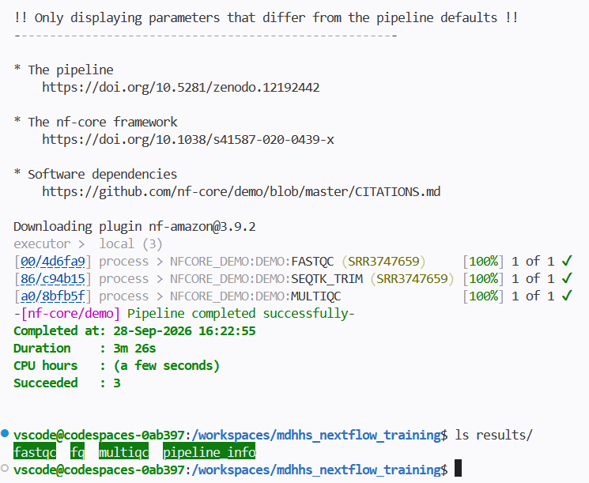

You should see the `Pipeline completed successfully message` along with additional time information. And if you list the contents the results directory: 

```
ls results/
```

It will be populated with our results:

1) fastqc - results from read QC assessment
2) fq - the SEQTK trimmed FASTQ files
3) multiqc - collection of results from individual tools into a report
4) pipeline_info - a directory containing various reports and files including:
    - [execution report](https://docs.seqera.io/nextflow/reports#execution-report): pipeline run information
    - [execution timeline](https://docs.seqera.io/nextflow/reports#execution-timeline): timelines of tasks in pipeline
    - [trace file](https://docs.seqera.io/nextflow/reports#trace-file): detailed task metrics
    - [workflow diagram](https://docs.seqera.io/nextflow/reports#workflow-diagram): graphical visualization of a pipeline run
    - software_mqc_versions.yml: provides pipleine, nextflow, and tool versions
    - Notice how some of the pipeline info files have the trace report suffix specified at pipeline launch. 

> [!Note]
> File names in the `pipeline_info` directory will contain the `trace_report_suffix` output at pipeline launch.  

<br>

Go ahead and download the multiqc report:

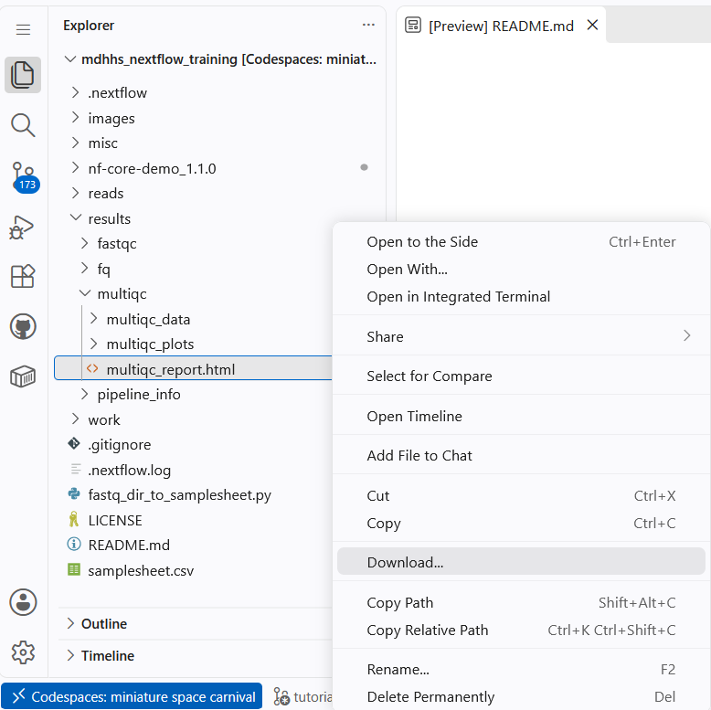

> [!NOTE] <br>
> When you right-click the file, you may need to toggle through the menus with the `Esc` key in order to see the "Download" option. 

Open the HTML file explore this file for a bit. We see that we have a report of the FASTQC results from our two FASTQ files. As you will see, more complex pipelines have larger multiQC reports providing summary results from tools used during the analysis. 

**The [MultiQC](https://seqera.io/multiqc/) report is an aggregate of bioinformatic analyses results**

Now, on your pipeline completion message, you should also notice the letters and numbers just below the word, "executor". For example, as shown in the image, two images above, three are separate lines, one for each tool run in the pipeline, and each line appears to have unique characters assigned to those tasks. Let's explore what this is. 


### Exploring Nextflow's resume feature

Re-run the nf-core-demo pipeline with the addition of the `-resume` flag:

```
nextflow run nf-core-demo_1.1.0/1_1_0/main.nf -profile docker --input samplesheet.csv --outdir results -resume
```

> [!NOTE] <br>
> `resume` is a nextflow core option <br>
> Remember: 1 dash because it's a core option, not a parameter that we're changing in the pipeline

<br>

What do you notice?

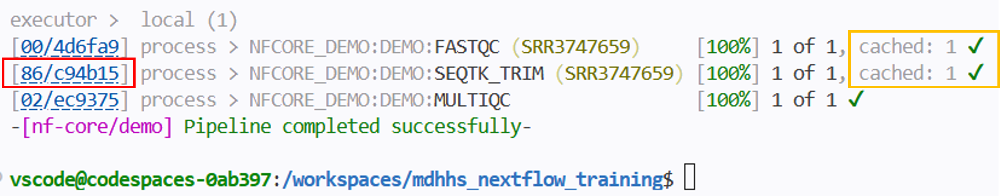

Tasks for FASTQC and SEQTK_TRIM say `cached` (orange box). And what you would notice, if this pipeline was much more computationally intensive, is that the pipeline would complete much faster. Because effectively, what the "cached" means is that that task was saved in a manner that doesn't require a re-analysis upon a pipeline re-run. 

This nextflow [resume feature](https://docs.seqera.io/nextflow/cache-and-resume) is permitted through the combination of the work directory and task cache. <br>
    - The work directory, `launchDir/work/`, stores the actual files associated with the task. The directories are organized by the unique hash associated with the task <br>
    - The task cache is stored in `launchDir/.nextflow/cache/`, organized by session ID. This directory stores metadata associated with your pipeline run <br>

<br>

> [!NOTE]
> Recall when we first launched our pipeline that the `launchDir` was specified as `/workspaces/mdhhs_nextflow_training`.

<br>

For example, let's explore the SEQTK_TRIM task within the work directory. Within the work directory, the unique hash, created from a MD5 checksum, always starts with a two-character prefix followed by the remainder of the hash in a subdirectory. My hash, based on the image above, starts with 86/c94b15 (red box).

<br>

**Yours will be different.**

<br>

 Navigate to your SEQTK_TRIM task within the work directory and display the contents of the directory:

<br>

```
#Starting from the launchDir
cd work/hash_to/seqtk_trim_task

#For my example in the image, above
work/86/c94b15783c2bb555ef025d7a837a43/

#list contents
ls

#list in long format
ll
```

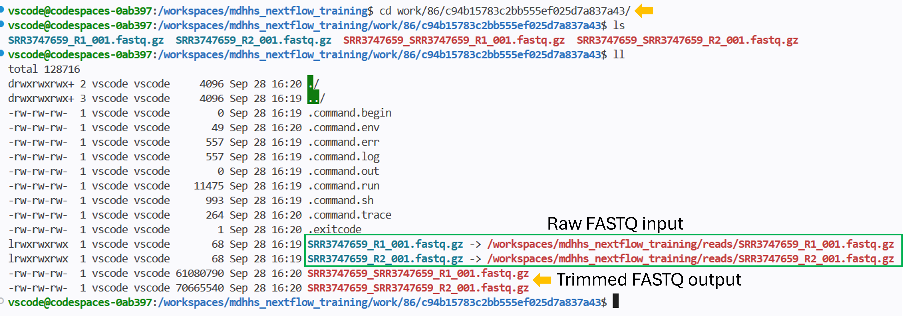

We notice that the full hash actually consists of 32 hexadecimal characters (the first two characters create the first directory within `work/` (in my example, 86) and the remaining 30 characters represent the sub-directory (in my example, c94b15783c2bb555ef025d7a837a43)). And using the long list command, we see that the input files came from our reads/ directory, which results in the trimmed FASTQ file outputs. 

Challenge: compare the file sizes of the trimmed FASTQ files to the raw FASTQ files to really convince yourself that SRR3747659_SRR3747659_R1_001.fastq.gz and SRR3747659_SRR3747659_R2_001.fastq.gz are the trimmed reads. 

We can see the actual command that was run by looking at the .command.sh file

```
cat .command.sh
```

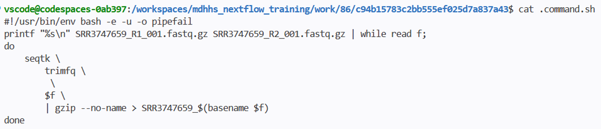

From the seqtk [GitHub repository](https://github.com/lh3/seqtk), we see the very basic usage of the seqtk trimfq command is as follow:

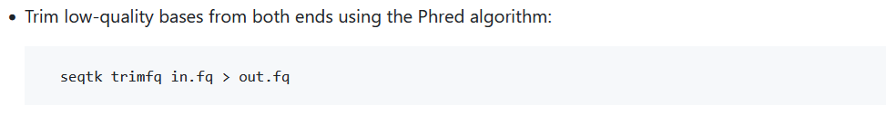

Which is exactly what is occurring in our nextflow pipeline, except with a little more bells and whistles to the command itself. Try copying and pasting the following command into your terminal. 

```
printf "%s\n" SRR3747659_R1_001.fastq.gz SRR3747659_R2_001.fastq.gz | while read f; 
do
    echo $f;
done
```

What is the output?

<details>
<summary>Reveal solution, here</summary>
SRR3747659_R1_001.fastq.gz <br>
SRR3747659_R2_001.fastq.gz

In other words, this command will loop through each of these files individually and execute the command that follows.
</details>

<br>

So in the nextflow pipeline script for SEQTK, each raw FASTQ file gets trimmed, piped to gzip, and renamed. 

Okay, so hopefully that provides you a little insight into the nextflow resume feature. The checkpoints provided by resume are particularly useful if your pipeline fails halfway through an analysis and you want to restart your pipeline without having to re-analyze everything from the beginning. 

> [!CAUTION] <br>
> Work directories can take up a lot of storage. <br>
> In our work, we delete the work directory once a pipeline successfully completes. <br>

### Exploring Nextflow's system logs 

Let's return to our `launchDir` (`/workspaces/mdhhs_nextflow_training`) 


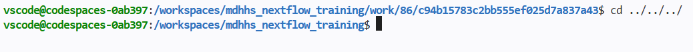


and run the following command:

```
nextflow log
```

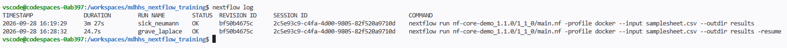

We see various information such as:

* TIMESTAMP
    - The files in /workspaces/mdhhs_nextflow_training/results/pipeline_info/ correspond to the timestamp
* COMMAND
    - The actual command run to invoke the nextflow pipeline
* DURATION
    - Again, notice how much faster the resumed pipeline completed compare to the original run
* RUN NAME 
    - The run name is the human-readable form allowing you to simply refer to a pipeline run. Recall that the "runName" was displayed at the pipeline launch. 
* SESSION ID
    - The task cache is organized by this unique session ID to form the basis of the resume feature

<br>

This task cache is located in: 
```
cd .nextflow/cache
ls
```


Again, this `cache` directory and the `work` directory form the basis of the `resume` feature functionality. Altering any of these directories breaks the `resume` feature and your pipeline would just start from the beginning on a subsequent run. 

In summary, all nextflow pipelines are able to be invoked from a single-line command providing nextflow core options and pipeline parameter inputs. <br>

Under the hood, nextflow has been designed as a powerful workflow management system that enables source tracking of all tasks and files created from an analysis. 
 

## Part III: Creating your first nextflow pipeline with nf-core CLI   


Let's make a new directory and call it "nextflow_training"

```
mkdir nextflow_training
```

And then change into directory we just created:

```
cd nextflow_training
```

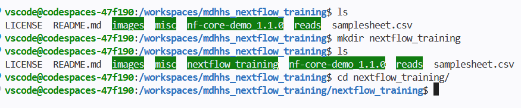

Now, let's create our first pipeline!

We will be building our pipeline using the [nf-core CLI](https://nf-co.re/docs/nf-core-tools). Check out the link. nf-core commands will always start with nf-core, followed by 1 of 4 categories (modules, pipelines, subworkflows, test-datasets), followed by a command within that category. For example, on your terminal, type: 

```
nf-core pipelines
```


You can see the list of available commands within the nf-core pipelines. In Part II, we used "download" to retrieve a previously built nf-core pipeline. Here, we will use the "create" command to create our first pipeline using the nf-core template. 


```
nf-core pipelines create -n "myfirstpipeline" -d "Tutorial for building nextflow pipelines with nf-core CLI" -a "John"
```

Where 
nf-core pipelines create: invokes an nf-core CLI command <br>
-n: name of your pipeline <br>
-d: description of pipeline <br>
-a: author <br>


Looks like it succeeded! Notice in the image below that my first attempt to create a pipeline failed:


Notice what was different?

<br>

<details>
<summary>Reveal solution, here</summary>
I attempted underscores in the pipeline name. 
</details>

<br>

The nf-core CLI did not allow that and my command errored out with the following error: 

```
"ERROR Invalid workflow name: must be lowercase" without punctuation.
```

This was easily fixed by removing the underscores. But, this was a nice introduction into the nf-core principles. You might be asking yourself, what exactly is [nf-core](https://nf-co.re/docs/get_started/nf-core)? In short, nf-core is a global community setting strict, best practices for building nextflow pipelines. You can create a nextflow pipeline, and then you can go beyond that to create an nf-core compliant nextflow pipeline. Specifications for creating an nf-core compliant nextflow pipeline can be viewed [here](https://nf-co.re/docs/specifications/overview). 

> [!NOTE] <br>
> We will not be creating an nf-core compliant nextflow pipeline for this nextflow training. <br>
> But, the nf-core CLI is an invaluable resource, and will be used in this tutorial series as we build our nextflow pipeline. <br>
> I also recommend it for all your future endeavors with building nextflow pipelines. 

Navigate to your file explorer pane on the VS Code editor and take a look at the contents of your new pipeline:


There is a lot to unpack here but we will only focus on the main aspects of building a nextflow pipeline in this beginner tutorial. 

We will encounter the following files:

1) **main.nf**: The default and required script for "nextflow run" command functioning if no other script is specified. Here, pipeline initialization checks occur and you can also specify which pipeline you want to run (stored in the workflows/ directory).
2) **nextflow.config**: the main configuration file containing default pipeline parameters and nextflow configuration options.

And the following directories: 

3) **assets/**: storage of reference files and databases
4) **conf/**: additional configuration files for module-specific parameters, defining compute, reference files, and testing
5) **workflows/**: location of individual files for pipelines. This is where we'll edit our workflow. Workflows contained here are executed from main.nf. Can contain multiple workflows herein, for example, if you had an Illumina pipeline and an ONT pipeline. 
6) **modules/**: where individual bioinformatics tools (called processes) of a pipeline are stored. Organized into nf-core/ and local/ directories depending if the module is sourced from nf-core (as you'll see in Tutorial 2 and 4) or manually created (as we'll encounter in Tutorial 3), respectively. 
7) **subworkflows/**: mini workflows chained together. Useful for a set of processes commonly used in a bioinformatics workflow (as we'll encounter in Tutorial 5).
8) **bin/**: custom scripts that can be incorporated into modules. NOTE: this directory is currently not present from our initial nf-core pipeline creation but we will make use of it in tutorial 5.

For more details on all files and directories, see [here](https://nf-co.re/docs/developing/pipelines/template-files).

A lot of files and directories have already been downloaded and prepared for you with that one command. That is the utility of the nf-core CLI. Nextflow expects and requires this pipeline organization of files and directories described, above. <br>

Now, we could have gone through the tedious process of creating all of these directories and files from scratch, but it's not worth it given the convenience of the nf-core CLI. And we will continue to make use of nf-core CLI to streamline our pipeline build. 

> [!NOTE] <br>
> It is important that you familiarize yourself with this general directory structure of nextflow. <br>
> These are common files and directories you'll see throughout all types of bioinformatics pipelines built with nextflow. <br>
> The details of these files and directories will become clearer throughout the tutorial. 

Congratulations! You just made your first nextflow pipeline! I hope you're excited for the long journey ahead as we build out our pipeline!

# Recap

In tutorial 1, we:
* learned installation steps to get nextflow running 
* familiarized ourselves with the nf-core CLI to download an nf-core pipeline
* prepared all components required for running the nf-core demo pipeline
* explored nextflow pipeline organization, basic functionality, and utlity of the `resume` feature
* created our first nextflow pipeline using the nf-core CLI

*Generally*, these are the major steps to get a nextflow pipeline running:

1) Obtain (or build) a pipeline of interest
2) Retrieve FASTQ files
3) Prepare sample sheet
4) Use `nextflow run` with required parameters to start the pipeline

Additional steps that may be needed include:
* configuring computing resources (as we experienced here) or other configs specific to your computing machine
* obtaining an external database (most databases are too large to store on GitHub).
* obtaining reference files 
* setting custom parameters and/or adding custom files

We will encounter some of these additional steps in later tutorials.


*Delete your codespace to save on free storage space quota*


Select the dropdown menu on your GitHub webpage:

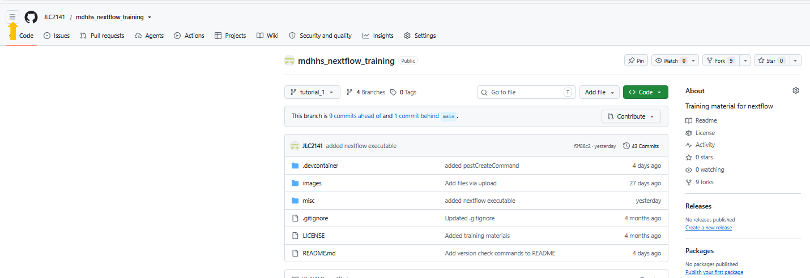


Select the `Codespaces` tab:

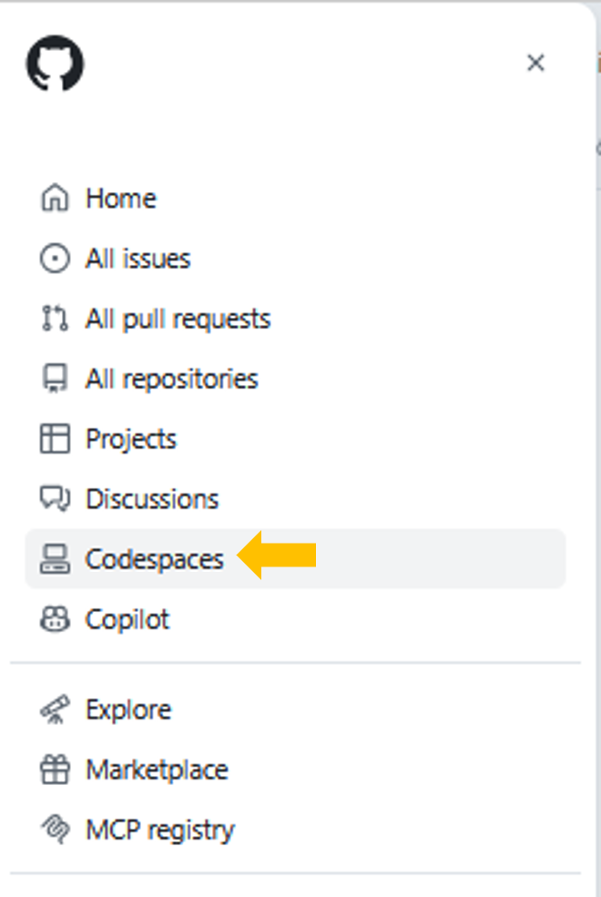

Select the "more options" icon (`...`) and delete codespace:

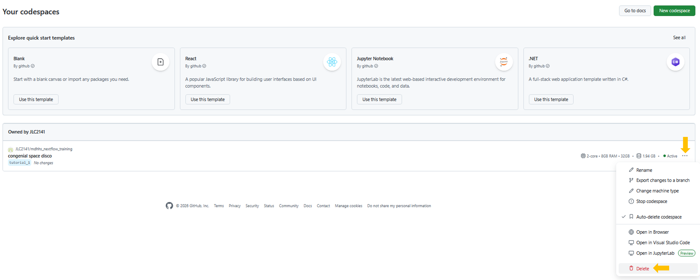
